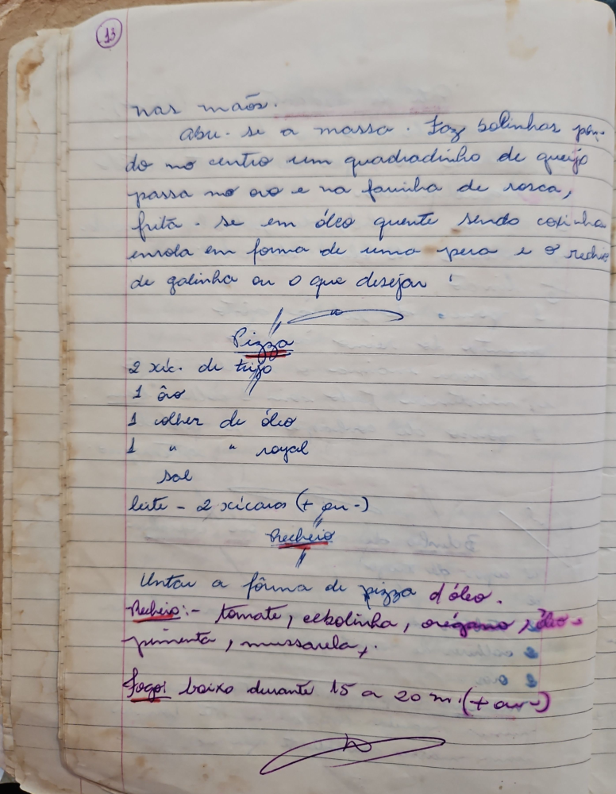

# Página 11
:::danger[NÃO REVISADO]
A página não foi revisada, portanto pode conter erros de digitação, formatação ou alucinações.
:::
nas mãos.
Abu-se a massa. Faz bolinhos por-
do no centro um quadradinho de queijo
passa no ovo e na farinha de rosca,
frita-se em óleo quente sendo cozida
enrola em forma de uma pera e o recheio
de galinha ou o que desejar.

## Pizza

### Ingredientes

- 2 xíc. de trigo
- 1 ão
- 1 colher de óleo
- 1 " " royol
- sal
- leite - 2 xícaras (+ ou -)

### Recheio

- tomate, cebolinha, oregano, alho,
- pimenta, mussarela.

### Modo de Preparo

- Untar a forma de pizza d'óleo.
- fogo baixo durante 15 a 20 m (+ ou-)

