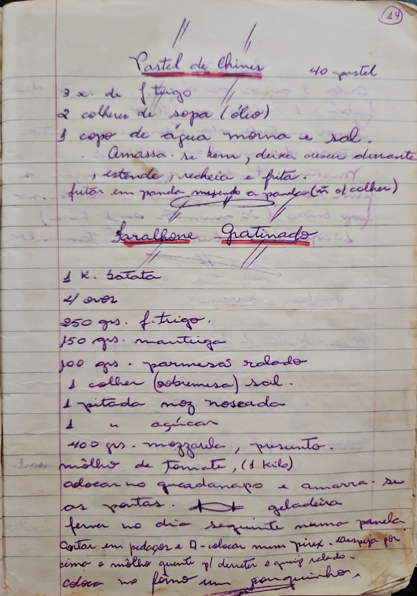

# Página 12
:::danger[NÃO REVISADO]
A página não foi revisada, portanto pode conter erros de digitação, formatação ou alucinações.
:::
## Pastel de Chines - 40 pastel

- 3 x de f. trigo
- 2 colheres de sopa (óleo)
- 1 copo de água morna e sal.

- Amassa-se bem, deixa crescer durante ...
- ... estende, recheia e frita.
- fritar em panela mexendo a panela (ou colher)

## Saralhone Gratinado

- 1 K. batata
- 4 ovos
- 250 grs. f. trigo.
- 150 grs. manteiga
- 100 grs. parmesãs ralado
- 1 colher (sobremesa) sal.
- 1 pitada noz noseada
- 1 " " açúcar
- 400 grs. mozzarela, presunto.
- molho de tomate, (1 kilo)

- colocar no guardanapo e amarra-se as pontas.
- geladeira
- ferver no dia seguinte numa panela.
- Cortar em pedaços e A-colocar num pirex. despeja por cima o molho quente p/ dereter e queijo ralado.
- coloca no forno um pouquinho.

