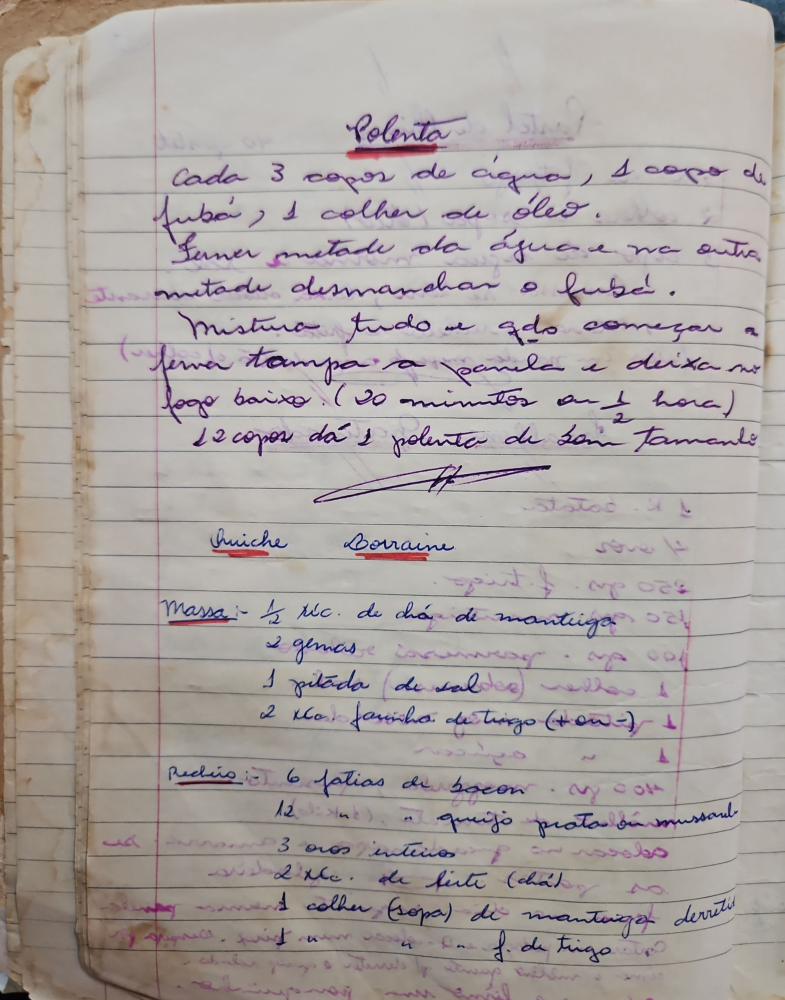

# Página 13
:::danger[NÃO REVISADO]
A página não foi revisada, portanto pode conter erros de digitação, formatação ou alucinações.
:::

## Polenta

Cada 3 copos de água, 1 copo de fubá, 1 colher de óleo.
Feruer metade da água e na outra metade desmanchar o fubá.
Mistura tudo e qdo começar a feruer tampa a panela e deixa no fogo baixo. (20 minutos a 1/2 hora)
12 copos dá 1 polenta de bom tamanho

## Quiche Lorraine

### Massa:
- 1/2 xic. de chá de manteiga
- 2 gemas
- 1 pitada (de sal)
- 2 xic. farinha de trigo (+ ou -)

### Recheio:
- 6 fatias de bacon
- 1/2 xic. de queijo prato ou mussarela
- 3 ovos inteiros
- 2 xic. de leite (chá)
- 1 colher (sopa) de manteiga derretida
- Sal e pimenta do reino a gosto.
- 1 colher de f. de trigo

