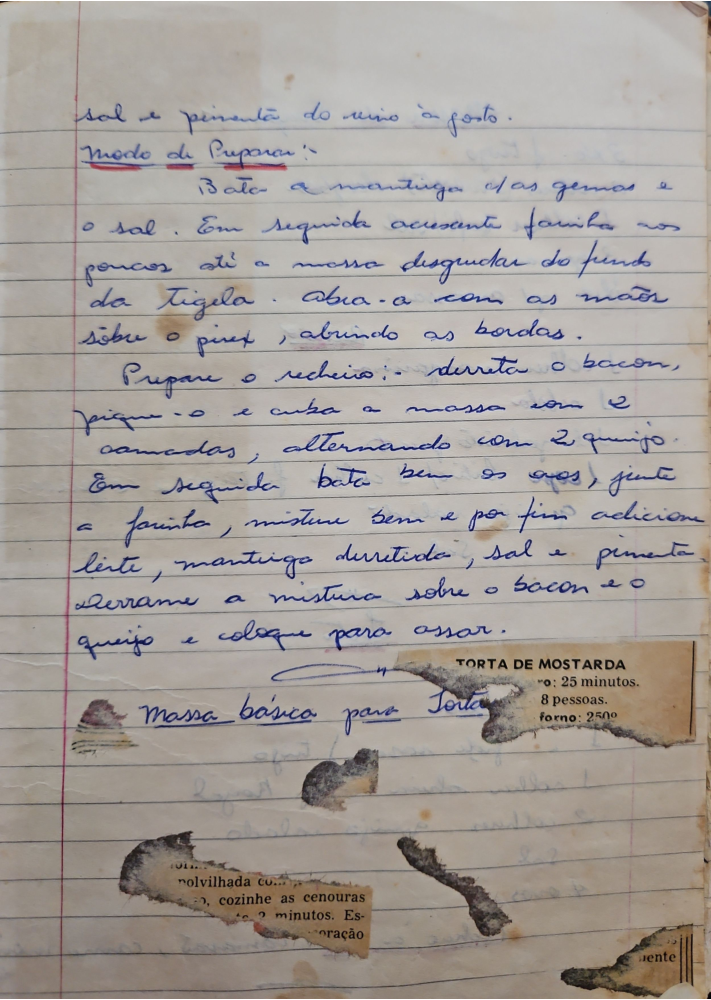

# Página 14
:::danger[NÃO REVISADO]
A página não foi revisada, portanto pode conter erros de digitação, formatação ou alucinações.
:::
sal e pimenta do reino à gosto.

**TORTA DE MOSTARDA**
Tempo: 25 minutos.
8 pessoas.
forno: 250°

## Modo de Preparar:
Bata a mantiga c/as gemas e o sal.
Em seguida accsente farinha aos poucos até a massa desgrudar do fundo da Tigela.
Abra-a com as mãos sobre o pires, abrindo as bordas.

### Prepare o recheio:
Derreta o bacon, pique-o e cubra a massa com 2 camadas, alternando com 2 queijo.
Em seguida bata bem os ovos, junte a farinha, misture bem e por fim adicione leite, mantiga derretida, sal e pimenta.
Derrame a mistura sobre o bacon e o queijo e coloque para assar.

Massa básica para Torta

polvilhada cu...
cozinhe as cenouras
2 minutos. Es...
ração

