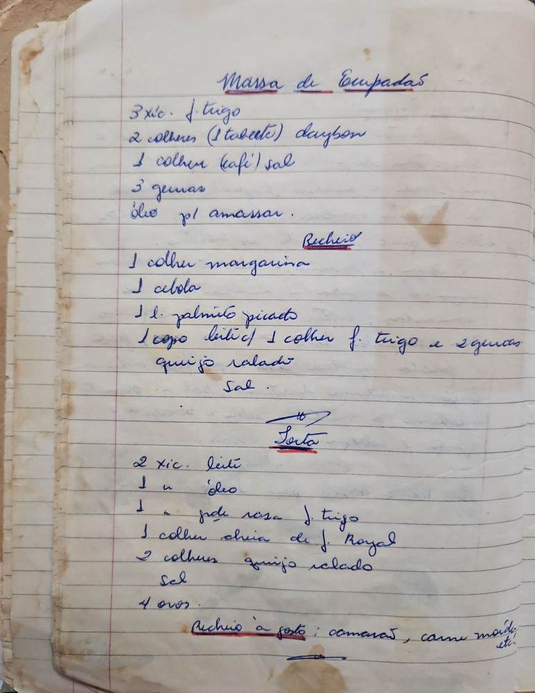

# Página 15
:::danger[NÃO REVISADO]
A página não foi revisada, portanto pode conter erros de digitação, formatação ou alucinações.
:::
## Massa de Empadas

- 3 xic. f. trigo
- 2 colhers (1 tabelete) daybon
- 1 colher kafi Sal
- 3 gemas
- óleo pl amassar.

### Recheio

- 1 colher margarina
- 1 cebola
- 1 l. palmito picado
- 1 copo leite c/ 1 colher f. trigo e 2 gemas
- queijo ralado
- Sal.

### Torta

- 2 xic. leite
- 1 u. óleo
- 1 u. fude rasa f. trigo
- 1 colher chria de f. Royal
- 2 colhers queijo ralado
- Sal
- 4 ovos

Recheio à gosto: camarão, carne moída etc.

