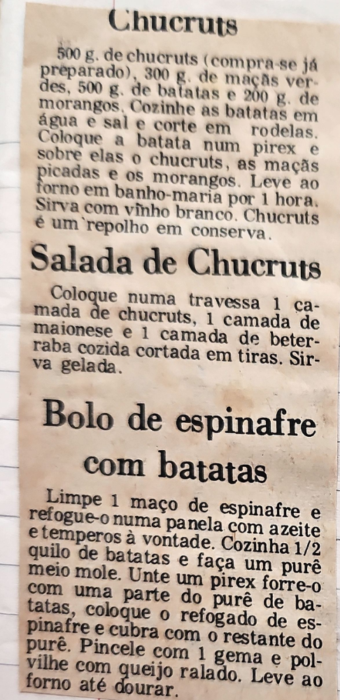

# Página 16
:::danger[NÃO REVISADO]
A página não foi revisada, portanto pode conter erros de digitação, formatação ou alucinações.
:::
## Chucruts

500 g. de chucruts (compra-se já preparado), 300 g. de maçãs verdes, 500 g. de batatas e 200 g. de morangos. Cozinhe as batatas em água e sal e corte em rodelas. Coloque a batata num pirex e sobre elas o chucruts, as maçãs picadas e os morangos. Leve ao forno em banho-maria por 1 hora. Sirva com vinho branco. Chucruts é um repolho em conserva.

## Salada de Chucruts

Coloque numa travessa 1 camada de chucruts, 1 camada de maionese e 1 camada de beterraba cozida cortada em tiras. Sirva gelada.

## Bolo de espinafre com batatas

Limpe 1 maço de espinafre e refogue-o numa panela com azeite e temperos à vontade. Cozinha 1/2 quilo de batatas e faça um purê meio mole. Unte um pirex forre-o com uma parte do purê de batatas, coloque o refogado de espinafre e cubra com o restante do purê. Pincele com 1 gema e polvilhe com queijo ralado. Leve ao forno até dourar.

