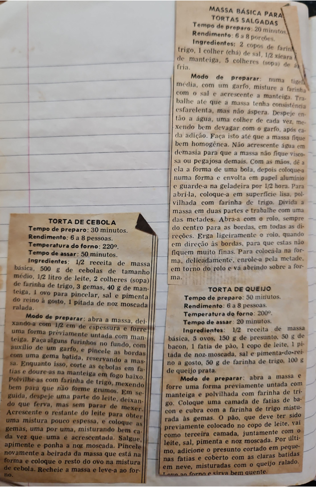

# Página 17
:::danger[NÃO REVISADO]
A página não foi revisada, portanto pode conter erros de digitação, formatação ou alucinações.
:::
## MASSA BÁSICA PARA TORTAS SALGADAS

**Tempo de preparo:** 20 minutos.
**Rendimento:** 6 a 8 porções.

**Ingredientes:**
*   2 copos de farinha de trigo,
*   1 colher (chá) de sal,
*   1/2 xícara de manteiga,
*   5 colheres (sopa) de água fria.

**Modo de preparar:** numa tigela média, com um garfo, misture a farinha com o sal e acrescente a manteiga. Trabalhe até que a massa tenha consistência esfarelenta, mas não áspera. Despeje então a água, uma colher de cada vez, mexendo bem devagar com o garfo, após cada adição. Faça isto até que a massa fique bem homogênea. Não acrescente água em demasia para que a massa não fique viscosa ou pegajosa demais. Com as mãos, dê a ela a forma de uma bola, depois coloque-a numa forma e envolta em papel alumínio e guarde-a na geladeira por 1/2 hora. Para abri-la, coloque-a em superfície lisa, polvilhada com farinha de trigo. Divida a massa em duas partes e trabalhe com uma das metades. Abra-a com o rolo, sempre do centro para as bordas, em todas as direções. Erga ligeiramente o rolo, quando em direção às bordas, para que estas não fiquem muito finas. Para colocá-la na forma, delicadamente, enrole-a pela metade, em torno do rolo e vá abrindo sobre a forma.

## TORTA DE CEBOLA

**Tempo de preparo:** 30 minutos.
**Rendimento:** 6 a 8 pessoas.
**Temperatura do forno:** 220º.
**Tempo de assar:** 50 minutos.

**Ingredientes:**
*   1/2 receita de massa básica,
*   500 g de cebolas de tamanho médio,
*   1/2 litro de leite,
*   2 colheres (sopa) de farinha de trigo,
*   3 gemas,
*   40 g de manteiga,
*   1 ovo para pincelar,
*   sal e pimenta do reino à gosto,
*   1 pitada de noz moscada ralada.

**Modo de preparar:** abra a massa, deixando-a com 1/2 cm de espessura e forre uma forma previamente untada com manteiga. Faça alguns furinhos no fundo, com auxílio de um garfo, e pincele as bordas com uma gema batida, reservando a massa. Enquanto isso, corte as cebolas em fatias e doure-as na manteiga em fogo baixo. Polvilhe-as com farinha de trigo, mexendo bem para que não forme grumos. Em seguida, despeje uma parte do leite, deixando que ferva, mas sem parar de mexer. Acrescente o restante do leite para obter uma mistura pouco espessa, e coloque as gemas, uma por uma, misturando bem cada vez que uma é acrescentada. Salgue, apimente e ponha a noz moscada. Pincele novamente a beirada da massa que está na forma e coloque o resto do ovo na mistura de cebola. Recheie a massa e leve-a ao forno.

## TORTA DE QUEIJO

**Tempo de preparo:** 50 minutos.
**Rendimento:** 6 a 8 pessoas.
**Temperatura do forno:** 200º.
**Tempo de assar:** 20 minutos.

**Ingredientes:**
*   1/2 receita de massa básica,
*   5 ovos,
*   150 g de presunto,
*   50 g de bacon,
*   1 fatia de pão,
*   1 copo de leite,
*   1 pitada de noz-moscada,
*   sal e pimenta-do-reino a gosto,
*   50 g de farinha de trigo,
*   100 g de queijo prato.

**Modo de preparar:** abra a massa e forre uma forma previamente untada com manteiga e polvilhada com farinha de trigo. Coloque uma camada de fatias de bacon e cubra com a farinha de trigo misturada às gemas. O pão, que deve ter sido previamente colocado no copo de leite, vai como terceira camada, juntamente com o leite, sal, pimenta e noz moscada. Por último, adicione o presunto cortado em pequenas fatias e coberto com as claras batidas em neve, misturadas com o queijo ralado. Leve ao forno e sirva bem quente.

