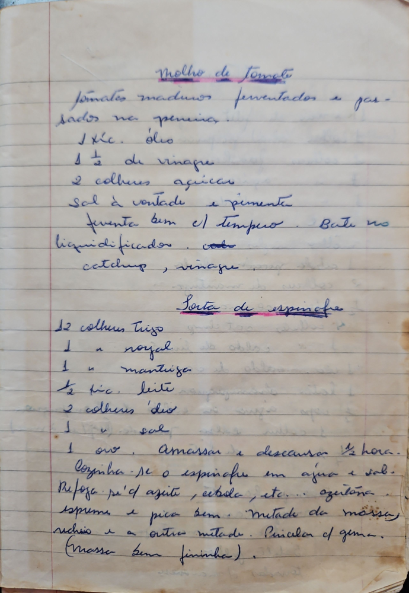

# Página 18
:::danger[NÃO REVISADO]
A página não foi revisada, portanto pode conter erros de digitação, formatação ou alucinações.
:::
## Molho de Tomate

- Tomates maduros ferventados e passados na peneira
- 1 xíc. óleo
- 1 ½ de vinagre
- 2 colheres açúcar
- Sal à vontade e pimenta

Ferventa bem c/ tempero. Bate no liquidificador. (codo ketchup, vinagre)

## Torta de espinafre

- 12 colheres trigo
- 1 n royal
- 1 n mantuiga
- ½ xíc. leite
- 2 colheres 'óleo'
- 1 n sal
- 1 ovo

Amassar e descansar ½ hora.

Cozinha-se o espinafre em água e sal. Refoga-se c/' azeite, cebola, etc... azeitona esprime e pica bem. Metade da massa, recheio e a outra metade. Pincelar c/ gema. (Massa bem fininha).

