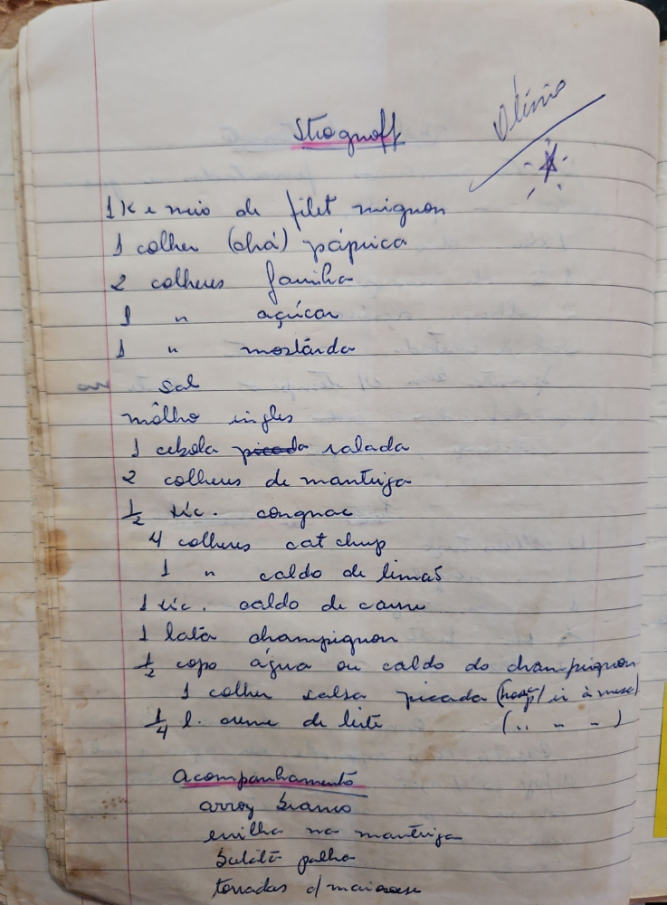

# Página 19
:::danger[NÃO REVISADO]
A página não foi revisada, portanto pode conter erros de digitação, formatação ou alucinações.
:::
## Stroganoff

*Olínio*

*   1 Kg e ½ de filet mignon
*   1 colher (chá) páprica
*   2 colheres farinha
*   1 " açúcar
*   1 " mostarda
*   Sal
*   molho ingles
*   1 cebola picada ralada
*   2 colheres de manteiga
*   ½ tic. cognac
*   4 colheres cat chup
*   1 " caldo de limão
*   1 tic. caldo de carne
*   1 lata champignon
*   ½ copo água ou caldo do champignon
*   1 colher salsa picada (hoje só à mesa)
*   ¼ l. creme de leite

### Acompanhamento

*   arroz branco
*   erva na manteiga
*   Batata palha
*   torradas c/ maionese

