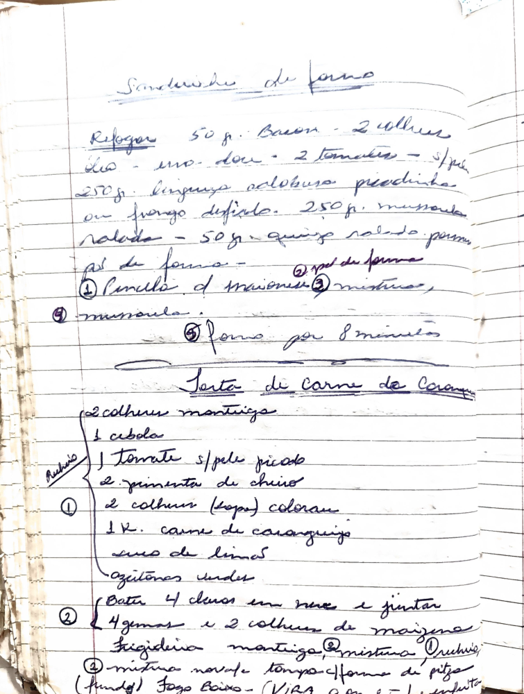

# Página 111
:::danger[NÃO REVISADO]
A página não foi revisada, portanto pode conter erros de digitação, formatação ou alucinações.
:::
## Sanduíche de forno

-   Refogar 50 g. Bacon - 2 alhos picado - 2 tomates - s/pele
-   250 g. linguiça calabresa picadinha ou frango desfiado
-   250 g. mussarela ralada
-   50 g. queijo salgado param. ralado

-   pão de forma
-   ① Pincelar c/ maionese
-   ② mistura
-   ③ mussarela
-   ④ forno por 8 minutos

## Torta de Carne de Caranguejo

-   ② colheres manteiga
-   ① cebola
-   ① tomate s/pele picado
-   ② pimenta de cheiro
-   ① 2 colheres (sopa) colorau
-   1 K. carne de caranguejo
-   suco de limão
-   Azeitonas verdes

-   ② Bater 4 claras em neve e juntar
-   4 gemas e 2 colheres de maizena

-   Frigideira manteiga
-   ③ mistura (recheio)
-   ④ mistura ovos
-   ⑤ no vate tempo
-   Forma de pitza (fundo)
-   Fogo baixo (VIRA ?)

