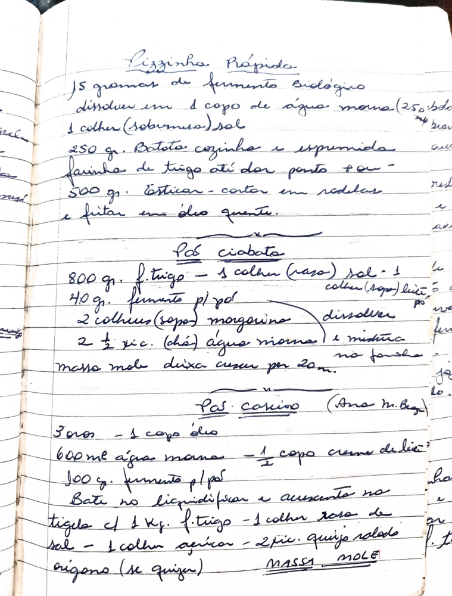

# Página 112
:::danger[NÃO REVISADO]
A página não foi revisada, portanto pode conter erros de digitação, formatação ou alucinações.
:::
## Pizzinha Rápida

-   15 gramas de fermento biológico
-   dissolver em 1 copo de água morna (250 ml) (p/brava)
-   1 colher (sobremesa) sal
-   250 gr. Batata cozida e espremida
-   farinha de trigo até dar ponto pão
-   500 gr. Esticar - cortar em rodelas
-   e fritar em óleo quente.

## Pão ciabata

-   800 g. f. trigo - 1 colher (rasa) sal - 1
-   colher (sopa) bicó
-   40 g. fermento pl/pó
-   2 colheres (sopa) margarina dissolver
-   2 ½ xíc. (chá) água morna na panela e mistura.
-   massa mole deixa crescer por 20m.

## Pão caseiro (Ana m. Beg)

-   3 ovos - 1 copo óleo
-   600 ml água morna - ½ copo creme de leite
-   100 g. fermento pl/pó
-   Bate no liquidificador e acrescente no
-   tigela cl 1 Kg. f. trigo - 1 colher rasa de
-   sal - 1 colher açucar - 2 pic. queijo ralado
-   origeno (se quiser)
-   MASSA MOLE

