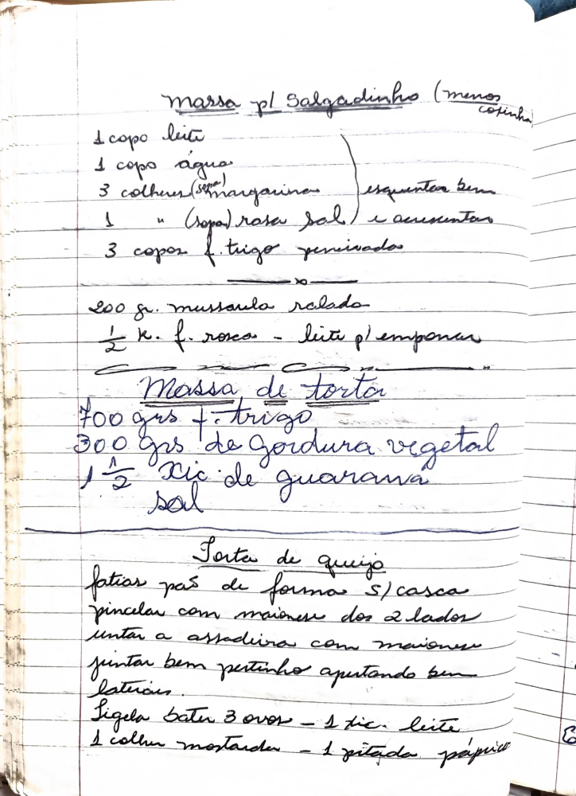

# Página 113
:::danger[NÃO REVISADO]
A página não foi revisada, portanto pode conter erros de digitação, formatação ou alucinações.
:::

## Massa pl Salgadinho (menos cozinhar)

- 1 copo leite
- 1 copo água
- 3 colheres (sopa) margarina
- 1 " (sopa) rasa sal

esquentar bem e acrescentar

- 3 copos f. trigo peneirados

***

200 gr. mussarela ralada
¹/₂ K. f. rosca - leite pl empanar

***

## Massa de Tortas

- 700 grs f. trigo
- 300 grs de gordura vegetal
- 1¹/² Xic. de guaraná
- Sal

***

## Torta de queijo

- fatias pão de formas s/casca
- pincelar com maionese dos 2 lados
- untar a assadeira com maionese
- juntar bem pertinho apertando bem laterais.
- Seguida bater
    - 3 ovos
    - 1 tic. leite
    - 1 colher mostarda
    - 1 pitada páprica

