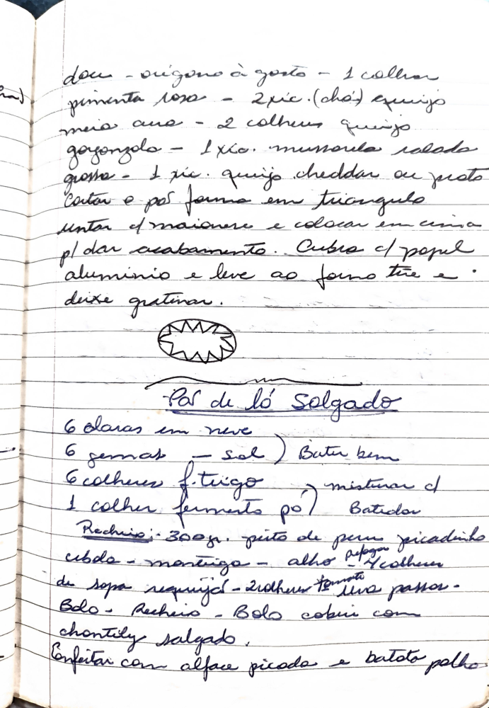

# Página 114
:::danger[NÃO REVISADO]
A página não foi revisada, portanto pode conter erros de digitação, formatação ou alucinações.
:::
Aqui está o texto extraído da imagem, formatado em markdown:

- origano a gosto - 1 colher
- pimenta rosa - 2 xic. (chá) esquizo
- maionese - 2 colheres queijo
- gorgonzola - 1 xic.
- mussarela ralada grossa - 1 xic. queijo cheddar ou prato
- Cortar e pôr forma em triangulo
- Juntar o maionese e colocar em cima
- p/ dar acabamento. Cubrir c/ papel
- aluminio e leve ao forno tire e
- deixe gratinar.

### Pão de Ló Salgado

- 6 claras em neve
- 6 gemas - sal ) Bater bem
- 6 colheres f. trigo ) misturar c/
- 1 colher fermento po' ) Batidora

Recheio:
- 300gr. peito de peru picadinho
- cubos - manteiga - alho paprica
- 4 colheres de sopa requeijão
- 2 colheres tâ. oliva passo-

- Bolo cobrir com chontily salgado.
- Enfeitar com alface picada e batata palha.

