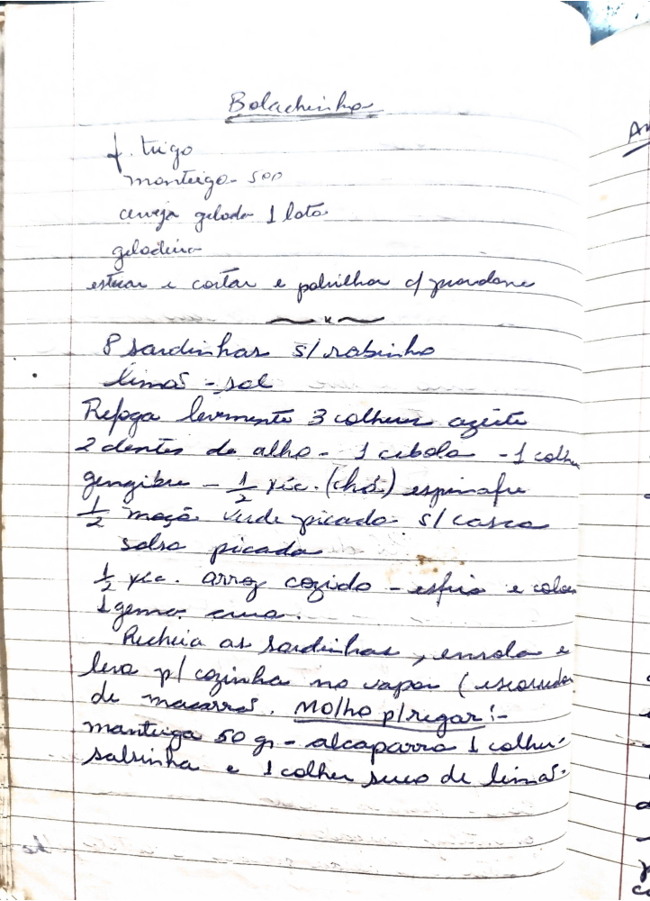

# Página 115
:::danger[NÃO REVISADO]
A página não foi revisada, portanto pode conter erros de digitação, formatação ou alucinações.
:::
## Bolachinha

- f. trigo
- manteiga - 500
- cerveja gelada 1 lata
- geladina
- estirar e cortar e polvilhar c/ queijo ralado

---

- 8 sardinhas s/ rabinho
- limão - sal

- Refoga levemente:
  - 3 colheres azeite
  - 2 dentes de alho
  - 1 cebola
  - 1 colher gengibre
  - ½ xíc. (chá) espinafre
  - ½ maçã verde picado - s/ casca
  - salsa picada
- ½ xíc. arroz cozido - escorrer e colocar
- 1 gema crua

- Recheia as sardinhas e enrola e leva p/ cozinhar no vapor (escorrer de macarrão)

### Molho p/ regar

- manteiga 50 gr
- alcaparra 1 colher
- salvinha e 1 colher suco de limão

