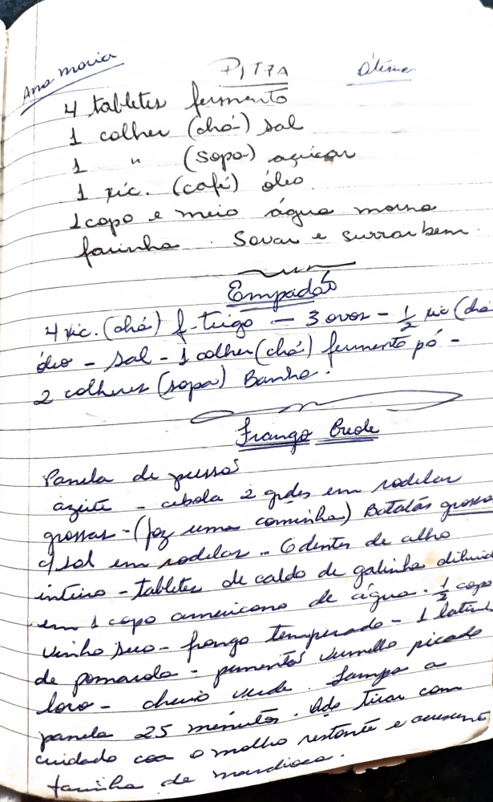

# Página 116
:::danger[NÃO REVISADO]
A página não foi revisada, portanto pode conter erros de digitação, formatação ou alucinações.
:::

## Pitta

### Ingredientes

*   4 tabletes fermento
*   1 colher (chá) sal
*   1 " (sopa) açúcar
*   1 xíc. (café) óleo
*   1 copo e meio água morna
*   farinha

Sovar e surrar bem.

---

## Empadão

### Ingredientes

*   4 xíc. (chá) f. trigo
*   3 ovos
*   ½ xíc. (chá) óleo
*   Sal
*   1 colher (chá) fermento pó
*   2 colheres (sopa) Banha.

---

## Frango Guede

Panela de pressão

*   azeite
*   cebola 2 grdes em rodelas grossas - (Faz uma caminha)
*   Batatas grossas em rodelas - "
*   6 dentes de alho inteiro
*   Tablete de caldo de galinha diluido em 1 copo americano de água.
*   ½ copo vinho suc.
*   Frango Temperado
*   1 lata de pomarola
*   pimentão vermelho picado
*   louro - cheiro verde

Tampa a panela 25 minutos. Depois Tirar com cuidado com o molho restante e acrescenta farinha de mandioca.

