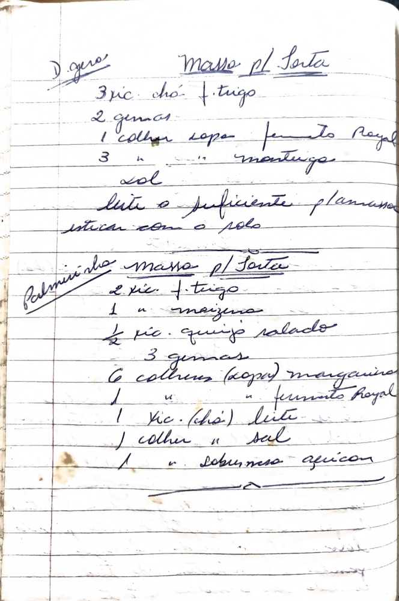

# Página 117
:::danger[NÃO REVISADO]
A página não foi revisada, portanto pode conter erros de digitação, formatação ou alucinações.
:::
## Massa p/ Torta

*   3 xic. chá f. trigo
*   2 gemas
*   1 colher sopa fermento Royal
*   3 colheres sopa manteiga
*   Sal
*   Leite o suficiente para amassar
*   Esticar com o rolo

## Palminho massa p/ Sorta

*   2 xic. f. trigo
*   1 xic. maizena
*   ½ xic. queijo salgado
*   3 gemas
*   6 colheres (sopa) margarina
*   1 colher (sopa) fermento Royal
*   1 xic. (chá) leite
*   1 colher sal
*   1 colher sobremesa açúcar

