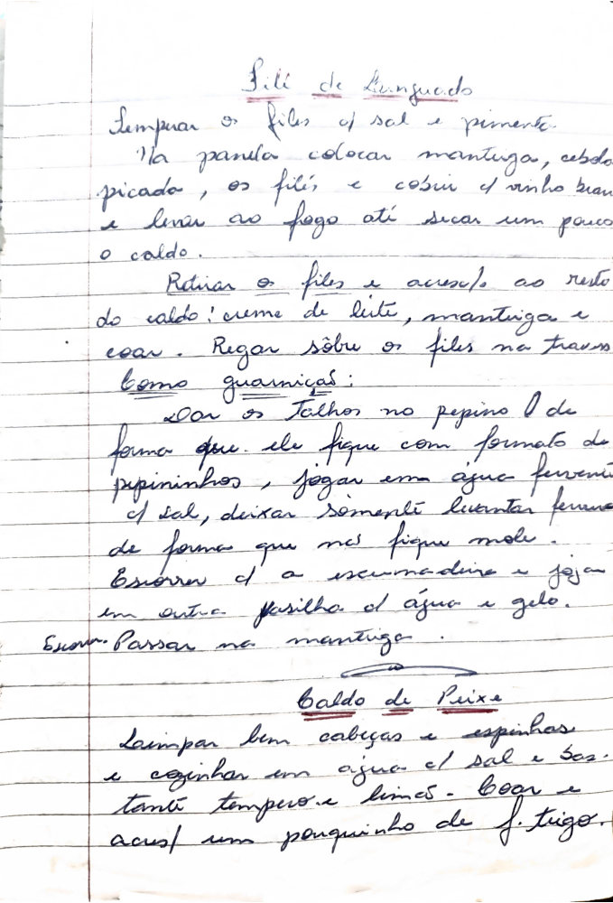

# Página 118
:::danger[NÃO REVISADO]
A página não foi revisada, portanto pode conter erros de digitação, formatação ou alucinações.
:::
## Filé de Linguado

- Temperar os filés c/ sal e pimenta.
- Na panela colocar manteiga, cebola picada, os filés, e cobrir c/ vinho branco e levar ao fogo até secar um pouco o caldo.
- Retirar os filés e acrescentar ao resto do caldo: creme de leite, manteiga e coar.
- Regar sobre os filés na travessa.

### Como guarniças:

- Cortar os talhos no pepino (de forma que ele fique com formato de pepininhos), jogar em agua fervente c/ sal, deixar somente levantar fervura de forma que não fique mole.
- Escorrer c/ a escumadeira e jogar em outra vasilha c/ agua e gelo.
- Escorrer.
- Passar na manteiga.

## Caldo de Peixe

- Limpar bem cabeças e espinhas
- e cozinhar em agua c/ sal e bes. tanto temperos e limão.
- Coar e acrescentar um pouquinho de f. trigo.

