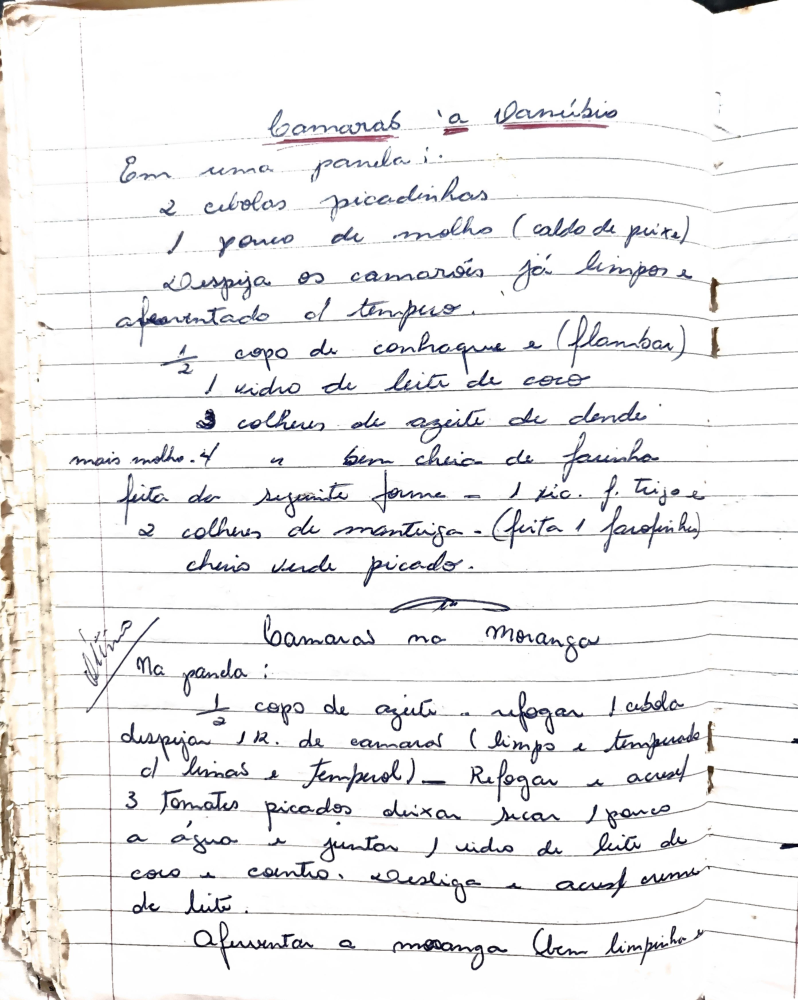

# Página 119
:::danger[NÃO REVISADO]
A página não foi revisada, portanto pode conter erros de digitação, formatação ou alucinações.
:::
## Camarão 'a Danúbio'
Em uma panela:
- 2 cebolas picadinhas
- 1 pouco de molho (caldo de peixe)
- Despeja os camarões já limpos e apimentado o tempero.
- ½ copo de conhaque e (flambar)
- 1 vidro de leite de coco
- 3 colheres de azeite de dendê
- mais molho.
- 4 e bem cheia de farinha feita da seguinte forma - 1 xic. f. trigo e 2 colheres de manteiga - (feita 1 farofinha)
- cheiro verde picado.

## Camarão no Morango
Na panela:
- ½ copo de azeite
- refogar 1 cebola
- despejar ½ K. de camarás (limpos e temperados o limas e tempero!)
- Refogar e acresc.
- 3 Tomates picados deixar secar o pouco a agua e juntar 1 vidro de leite de coco com o coentro. Desliga e acresc creme de leite.
- Afuventar a morango (bem limpinho)

