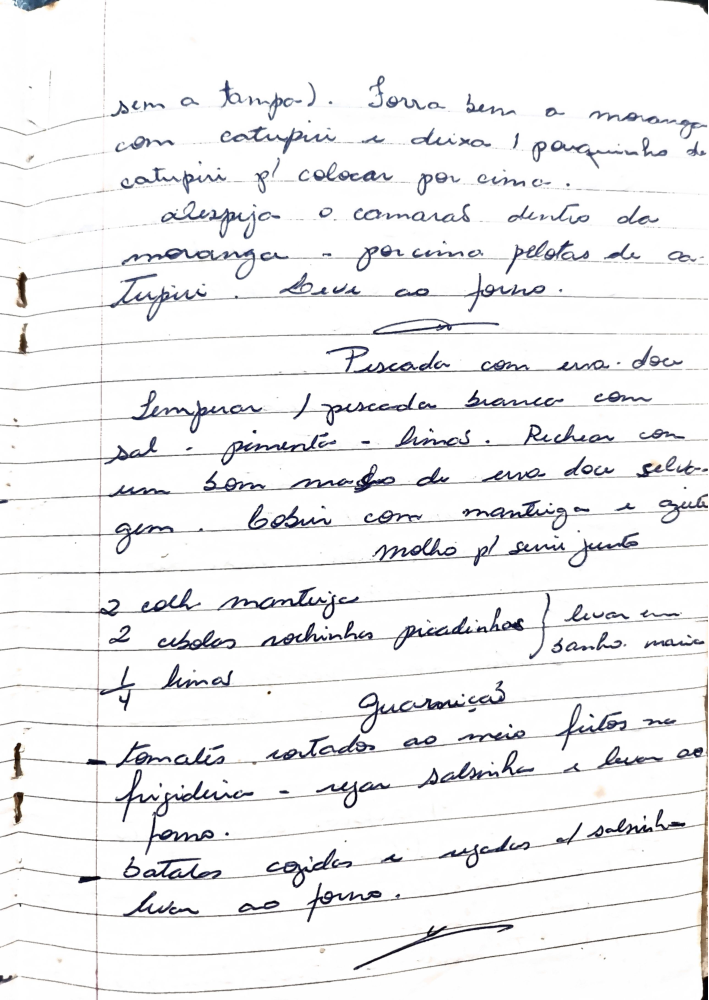

# Página 120
:::danger[NÃO REVISADO]
A página não foi revisada, portanto pode conter erros de digitação, formatação ou alucinações.
:::
## Moranga com Camarão e Catupiri

- sem a tampa.
- Forra bem a moranga com catupiri e deixa 1 pouquinho de catupiri p/ colocar por cima.
- Despeja o camarão dentro da moranga - por cima pelotas de catupiri.
- Leve ao forno.

## Pescada com uva-doce

- Temperar 1 pescada branca com sal, pimenta, limão.
- Rechear com um bom maço de uva doce seleta.
- cozinhar com manteiga e azeite
- molho p/ servir junto

### Molho (levar em banho maria)

- 2 colh manteiga
- 2 cebolas roxinhas picadinhas
- 1/4 limão

### Guarnições

- Tomates cortados ao meio fritos na frigideira - regar salsinha e levar ao forno.
- batatas cozidas e regadas c/ salsinha - levar ao forno.

