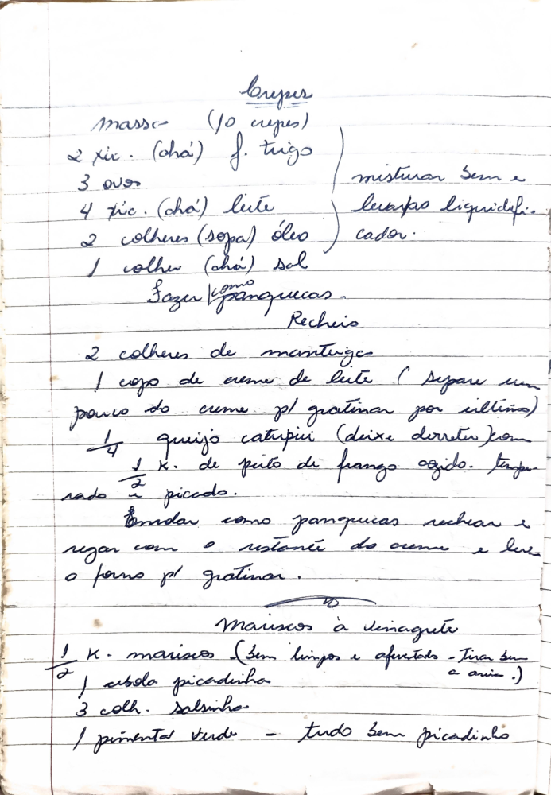

# Página 121
:::danger[NÃO REVISADO]
A página não foi revisada, portanto pode conter erros de digitação, formatação ou alucinações.
:::

## Crepes

### Massa (10 crepes)

*   2 xíc. (chá) f. trigo
*   3 ovos
*   4 xíc. (chá) leite
*   2 colheres (sopa) óleo
*   1 colher (chá) sal

Misturar bem e levar ao liquidificador.
Fazer como panquecas.

### Recheio

*   2 colheres de manteiga
*   1 copo de creme de leite (Separar um pouco do creme p/ gratinar por último)
*   1/4 quijo catupiri (deixe derreter)
*   1 xíc. de peito de frango cozido. Temperado e picado.

Montar como panquecas rechear e regar com o restante do creme e levar o forno p/ gratinar.

---

## Mariscos à vinagrete

*   1/2 K. mariscos (sem bingos e apertados - Tirar bem a areia :)
*   1/2 cebola picadinha
*   3 colh. salsinha
*   1 pimentão verde - tudo bem picadinho

