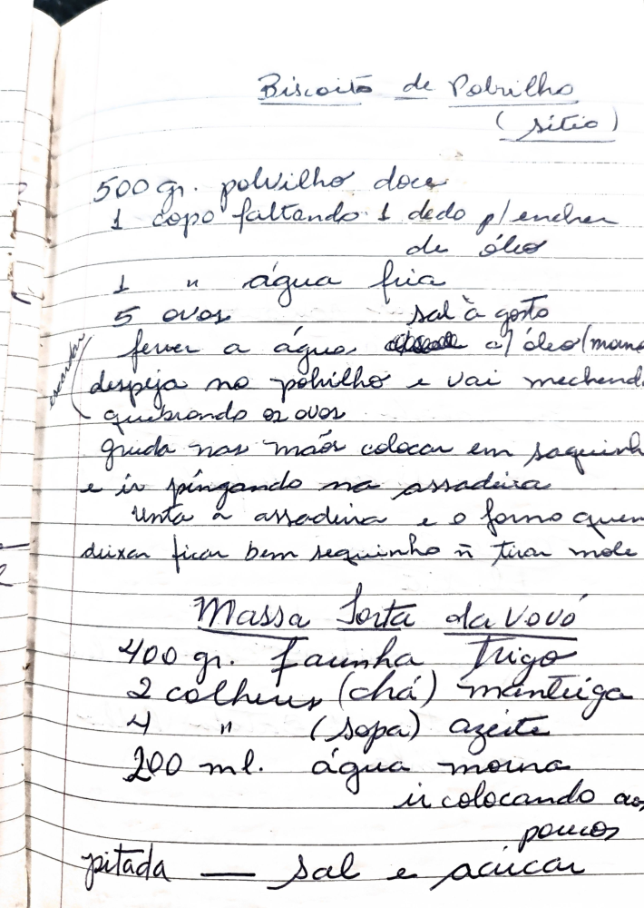

# Página 122
:::danger[NÃO REVISADO]
A página não foi revisada, portanto pode conter erros de digitação, formatação ou alucinações.
:::
## Biscoito de Polvilho
(sitio)

*   500 gr. polvilho doce
*   1 copo faltando 1 dedo p/ encher de óleo
*   1 " água fria
*   5 ovos
*   sal à gosto

ferver a água, o óleo e o sal
despeja no polvilho e vai mexendo
quebrando os ovos
gruda nas mãos colocar em saquinho e ir pingando na assadeira
unta a assadeira e o forno quente
deixar ficar bem sequinho ñ tirar mole

## Massa Sorta da Vovó

*   400 gr. Farinha Trigo
*   2 colheres (chá) Manteiga
*   4 " (Sopa) Azeite
*   200 ml. água morna
    *   ir colocando aos poucos
*   pitada - sal e açúcar

