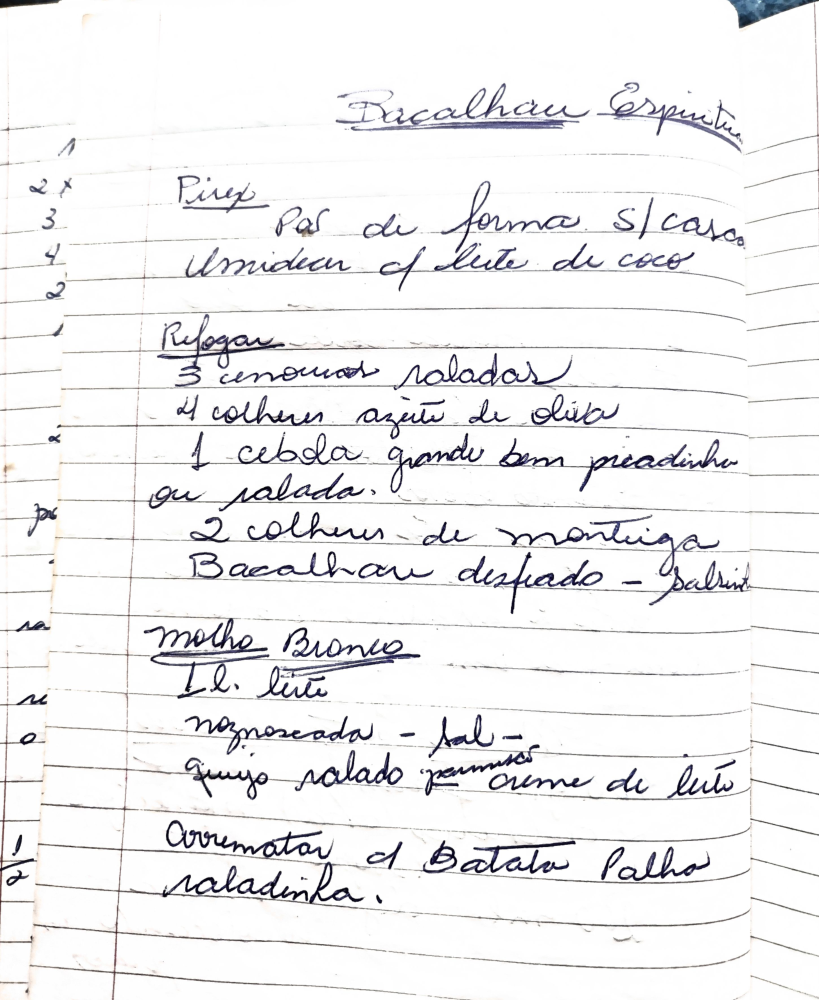

# Página 123
:::danger[NÃO REVISADO]
A página não foi revisada, portanto pode conter erros de digitação, formatação ou alucinações.
:::
## Bacalhau Espíritu

### Purê
- Pão de forma s/ casca
- Amido de leite de coco

### Refogar
- 3 cenouras raladas
- 4 colheres azeite de oliva
- 1 cebola grande bem picadinha ou ralada.
- 2 colheres de manteiga
- Bacalhau desfiado - pálido

### Molho Branco
- 1 Litro leite
- noz-moscada - sal -
- queijo ralado parmesão, creme de leite

### Arrematar
- Batata Palha saladinha.

