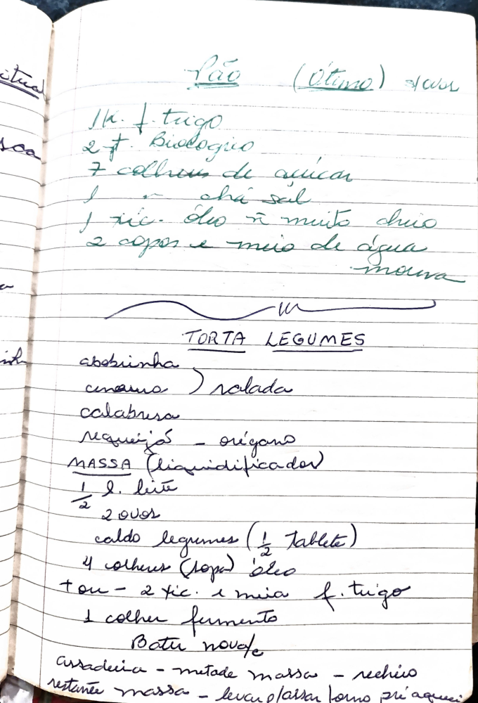

# Página 124
:::danger[NÃO REVISADO]
A página não foi revisada, portanto pode conter erros de digitação, formatação ou alucinações.
:::
## Pão (Ótimo) varr

- 1 kg f trigo
- 2 f Biologico
- 7 colher de açúcar
- 1 cha sal
- 1 xic óleo n muito cheio
- 2 copos e meio de água moura

## TORTA LEGUMES

- abobrinha
- cenoura ) ralada
- calabresa
- Requeijão - orégano

### MASSA (Liquidificador)

- 1/2 l. leite
- 2 ovos
- caldo legumes (1/2 Tablete)
- 4 colheres (sopa) óleo
- tou - 2 xic. e meia f. trigo
- 1 colher fermento

- Bater novofe
- assadeiva - metade massa - recheio restante massa - levar p/assar forno pré aqueci

