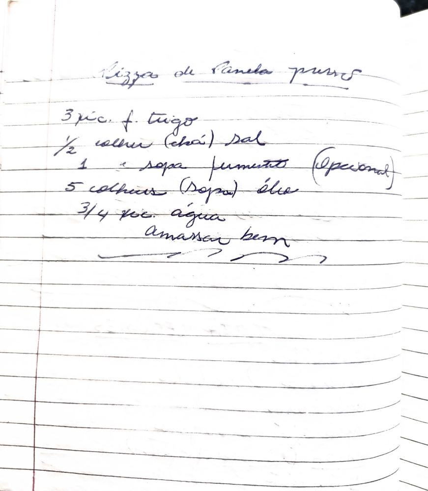

# Página 125
:::danger[NÃO REVISADO]
A página não foi revisada, portanto pode conter erros de digitação, formatação ou alucinações.
:::
## Pizza de Panela purra

*   3 xic. f. trigo
*   ½ colher (chá) sal
*   1 sopa fermento (Opcional)
*   5 colheres (sopa) óleo
*   3/4 xic. água

amassar bem

