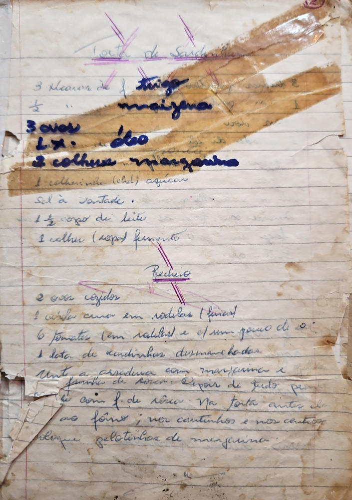

# Página 126
:::danger[NÃO REVISADO]
A página não foi revisada, portanto pode conter erros de digitação, formatação ou alucinações.
:::
## Torta de Sardinha

- 3 xícaras de farinha trigo
- ½ xícara de maizena
- 3 ovos
- 1 xícara de Leite
- 3 colheres margarina
- 1 colherinha (chá) açúcar
- Sal à vontade.
- 1 ½ copo de leite
- 1 colher (sopa) fermento

### Recheio

- 2 ovos cozidos
- 1 cebola crua em rodelas (finas)
- 6 tomates em rodelas e um pouco de oré
- 1 lata de sardinhas desmanchadas.

Unte a assadeira com margarina e
farinha de rosca.
Depois de tudo pronta
a forma com f. de rosca. Na torta antes de
ir ao forno; nos cantinhos e no centro
coloque gelotinhos de margarina.

