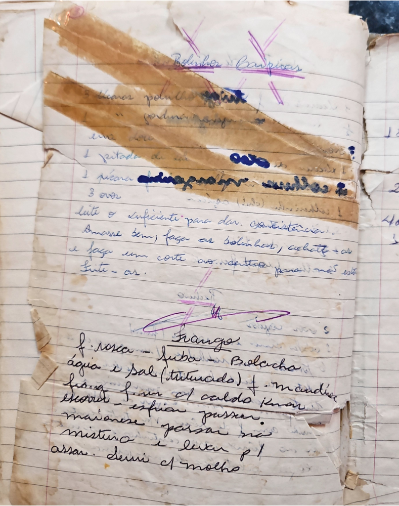

# Página 127
:::danger[NÃO REVISADO]
A página não foi revisada, portanto pode conter erros de digitação, formatação ou alucinações.
:::
## Bolinhos Caipiras

- 8 xícaras polvilho azedo
- polvilho doce
- uma xícara doce
- 1 pitada de sal
- 1 xícara [ilegível] ou [ilegível]
- 3 ovos
- leite o suficiente para dar consistência.
- Amasse bem, faça os bolinhos, achatte-os
- e faça um corte ao centro para não estourar.
- Frite-as.

## Frango

- f. rosca - fuba - Bolacha
- água e sal (triturado) - mandioca
- frango desfiado do caldo picado
- escorrer
- esfriar
- passar maionese
- passar na mistura
- levar p/ assar.
- Servir c/ molho

