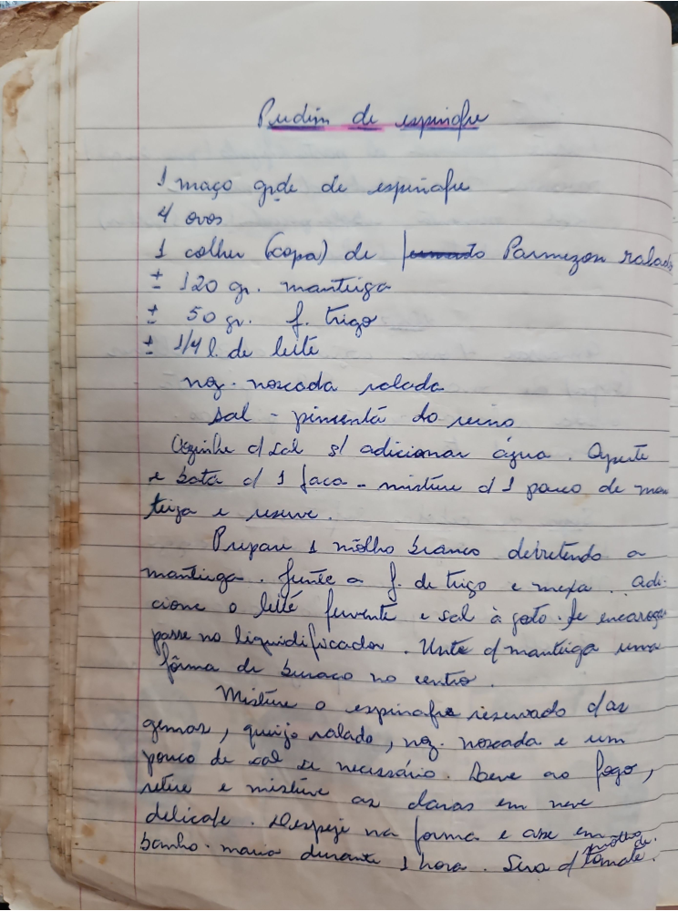

# Página 21
:::danger[NÃO REVISADO]
A página não foi revisada, portanto pode conter erros de digitação, formatação ou alucinações.
:::
## Pudim de Espinafre

### Ingredientes

*   1 maço grande de espinafre
*   4 ovos
*   1 colher (sopa) de queijo Parmeson ralado
*   ± 120 gr. manteiga
*   ± 50 gr. f. trigo
*   ± 1/4 l. de leite
*   noz moscada ralada
*   sal - pimenta do reino

### Modo de Preparo

*   Cozinhe o sal se adicionar água. Aperte a gema de 1 faca - misture de 1 pouco de manteiga e reserve.
*   Prepare o molho branco derretendo a manteiga. Junite a f. de trigo e mexa. Adicione o leite fervente e sal a gosto. Se encarregar passe no liquidificador. Unite a manteiga numa fôrma de buraco no centro.
*   Misture o espinafre reservado as gemas, queijo ralado, noz moscada e um pouco de sal se necessário. Leve ao fogo, retire e misture as gemas em neve delicado.
*   Despeje na forma e asse em banho maria durante 1 hora. Sirva quente.

