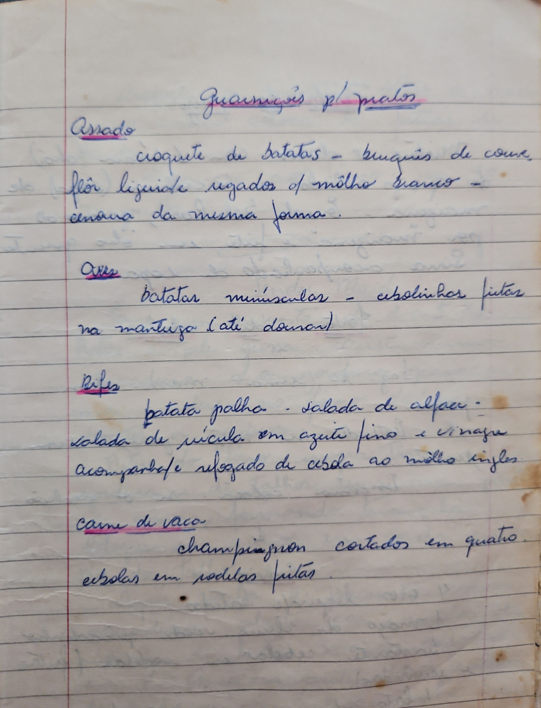

# Página 22
:::danger[NÃO REVISADO]
A página não foi revisada, portanto pode conter erros de digitação, formatação ou alucinações.
:::
## Guarnições p/ pratos

## Assado
- croquete de batatas - buquês de couve flor lig. rale regados c/ molho branco - cenoura da mesma forma.

## Aves
- batatas minúsculas - cebolinhas fritas na manteiga (até dourar)

## Bifes
- batata palha - salada de alface - salada de rúcula em azeite fino e vinagre acompanhada refogado de cebola ao molho inglês

## Carne de vaca
- champignon cortados em quatro
- cebolas em rodelas fritas

