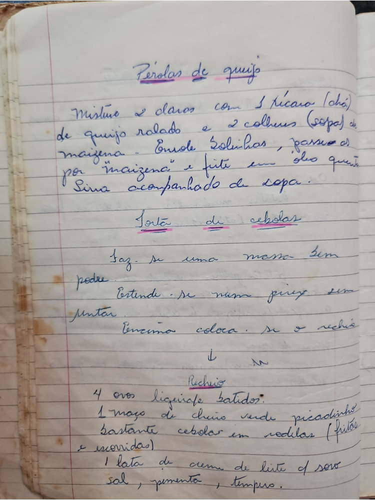

# Página 23
:::danger[NÃO REVISADO]
A página não foi revisada, portanto pode conter erros de digitação, formatação ou alucinações.
:::
## Pérolas de queijo

Misture 2 claras com 1 xícara (chá) de queijo ralado e 2 colheres (sopa) de maizena. Enrole bolinhas, passe-as por maizena e frite em óleo quente. Sirva acompanhado de sopa.

## Torta de cebolas

Faz-se uma massa sem podre.
Estende-se numa pyrex sem untar.
Em cima coloca-se o recheio.

### Recheio

- 4 ovos ligeirafe batidos
- 1 maço de cheiro verde picadinho
- bastante cebolas em rodelas (fritas e escorridas)
- 1 lata de creme de leite c/ sôro
- sal, pimenta, temperos.

