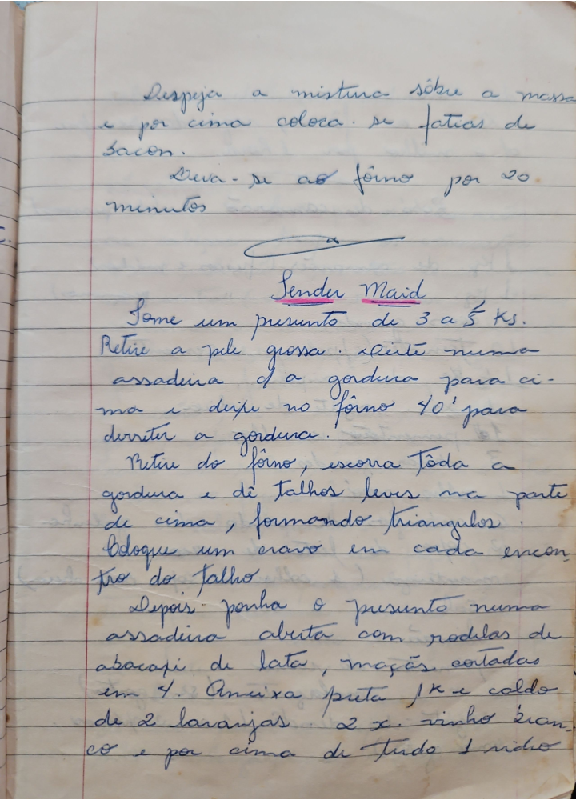

# Página 24
:::danger[NÃO REVISADO]
A página não foi revisada, portanto pode conter erros de digitação, formatação ou alucinações.
:::
- Despeja a mistura sobre a massa
- e por cima coloca se fatias de bacon.
- Leva-se ao forno por 20 minutos

## Sender Maid
- Tome um presunto de 3 a 5 Ks.
- Retire a pele grossa. Unta numa assadeira a gordura para cima e deixe no forno 40' para derreter a gordura.
- Retire do forno, escorra toda a gordura e dê talhos leves na parte de cima, formando triangulos.
- Coloque um cravo em cada encontro do talho.
- Depois ponha o presunto numa assadeira aberta com rodelas de abacaxi de lata, maçãs cortadas em 4.
- Ameixa preta jk e caldo de 2 laranjas. 2 x. vinho branco e por cima de tudo 1 vidro

