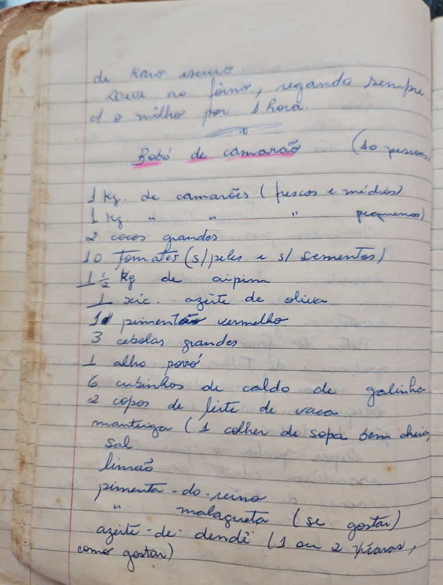

# Página 25
:::danger[NÃO REVISADO]
A página não foi revisada, portanto pode conter erros de digitação, formatação ou alucinações.
:::
## Bobó de Camarão

(10 pessoas)

- 1 Kg. de camarões (frescos e médios)
- 1 Kg. de camarões (pequenos)
- 2 cocos grandes
- 10 tomates (sem peles e sem sementes)
- 1 1/2 Kg de aipim
- 1 xícara azeite de oliva
- 1 pimentão vermelho
- 3 cebolas grandes
- 1 alho poró
- 6 cubinhos de caldo de galinha
- 2 copos de leite de vaca
- manteiga (1 colher de sopa bem cheia)
- Sal
- limão
- pimenta - do reino
- malagueta (se gostar)
- azeite de dendê (1 ou 2 fios, como gostar)

