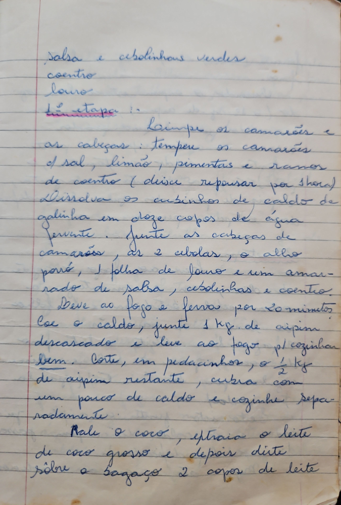

# Página 26
:::danger[NÃO REVISADO]
A página não foi revisada, portanto pode conter erros de digitação, formatação ou alucinações.
:::
- salsa e cebolinhas verdes
- coentro
- louro

## 1ª etapa

- Limpe os camarões e as cabeças:
- Tempere os camarões com sal, limão, pimentas e ramos de coentro (deixe repousar por 1 hora)
- Dissolva os cubinhos de caldo de galinha em doze copos de água fervente.
- Junte as cabeças de camarões, as 2 cebolas, o alho porró, 1 folha de louro e um amarrado de salsa, cebolinhas e coentro.
- Leve ao fogo e ferva por 20 minutos.
- Coe o caldo,
- Junte 1 Kg de aipim descascado e leve ao fogo para cozinhar bem.
- Corte, em pedacinhos, o ½ Kg de aipim restante, cubra com um pouco de caldo e cozinhe separadamente.

- Rale o coco, extraia o leite de coco grosso e depois dilua sobre o bagaço 2 copos de leite

