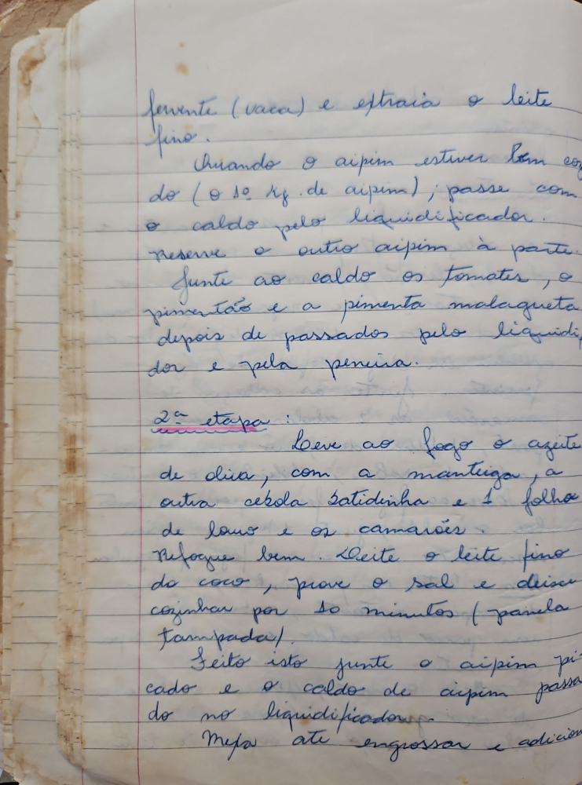

# Página 27
:::danger[NÃO REVISADO]
A página não foi revisada, portanto pode conter erros de digitação, formatação ou alucinações.
:::
- fervente (vaca) e extraia o leite fino.
- Quando o aipim estiver bem cozido (o 1/2 Kg. de aipim); passe com o caldo pelo liquidificador.
- Reserve o outro aipim à parte.
- Junte ao caldo os tomates, o pimentão e a pimenta malagueta depois de passados pelo liquidificador e pela peneira.

### 2ª etapa

- Leve ao fogo o azeite de oliva, com a manteiga, a outra cebola batidinha e 1 folha de louro e os camarões.
- Refogue bem.
- Junte o leite fino do coco, prove o sal e deixe cozinhar por 10 minutos (panela tampada).
- Feito isto junte o aipim picado e o caldo de aipim passado no liquidificador.
- Mexa até engrossar e adicio...

