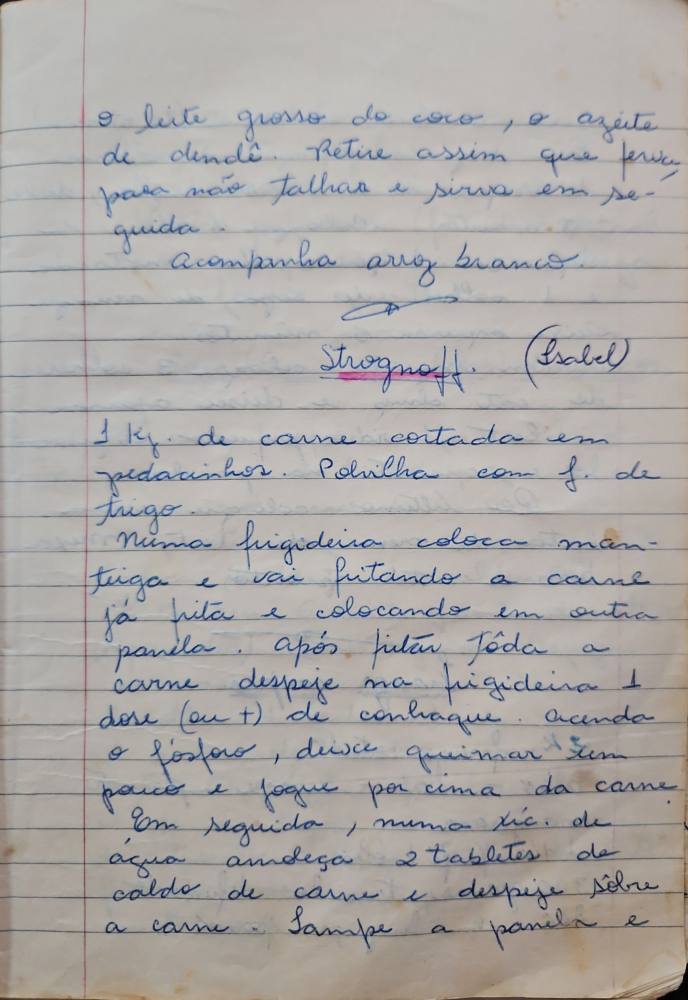

# Página 28
:::danger[NÃO REVISADO]
A página não foi revisada, portanto pode conter erros de digitação, formatação ou alucinações.
:::
o leite grosso do coco, o azeite de dendê. Retire assim que ferver para não Talhar e sirva em seguida.
Acompanha arroz branco.

---

## Strogonoff. (Isabel)

---

* 1 Kg de carne cortada em pedacinhos.

Polvilha com f. de trigo.
Numa frigideira coloca manteiga e vai fritando a carne já frita e colocando em outra panela.
após fritar tôda a carne despeje na frigideira 1 dose (ou +) de conhaque.
acenda o fosforo, deixe queimar um pouco e jogue por cima da carne.
Em seguida, numa xic. de água amdeça 2 tabletes de caldo de carne e despeje sôbre a carne.
Tampe a panela e

