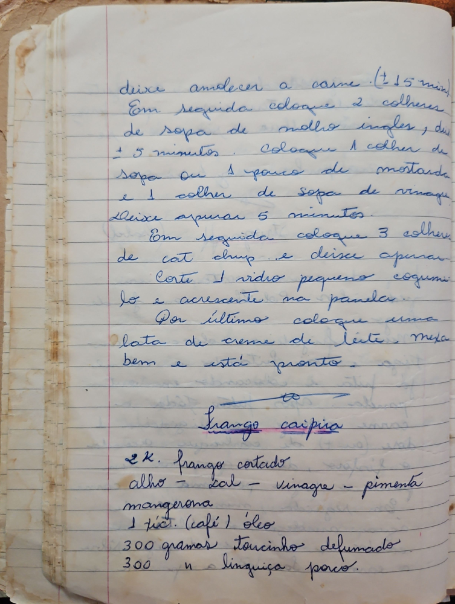

# Página 29
:::danger[NÃO REVISADO]
A página não foi revisada, portanto pode conter erros de digitação, formatação ou alucinações.
:::
## Instruções (Parte 1)

1.  Deixe amolecer a carne (+ 15 min)
2.  Em seguida coloque 2 colheres de sopa de molho inglês, deixe ferver (?) + 5 minutos.
3.  Coloque 1 colher de sopa ou 1 pouco de mostarda e 1 colher de sopa de vinagre
4.  Deixe apurar 5 minutos
5.  Em seguida coloque 3 colheres de catchup e deixe apurar
6.  Corte 1 vidro pequeno cogumelo e acrescente na panela.
7.  Por último coloque uma lata de creme de leite. Mexa bem e está pronto.

---

## Frango caipira

### Ingredientes

*   2 kg. frango cortado
*   alho
*   sal
*   vinagre
*   pimenta
*   mangerona
*   1 xic. (café) óleo
*   300 gramas toucinho defumado
*   300 g linguiça porco.

