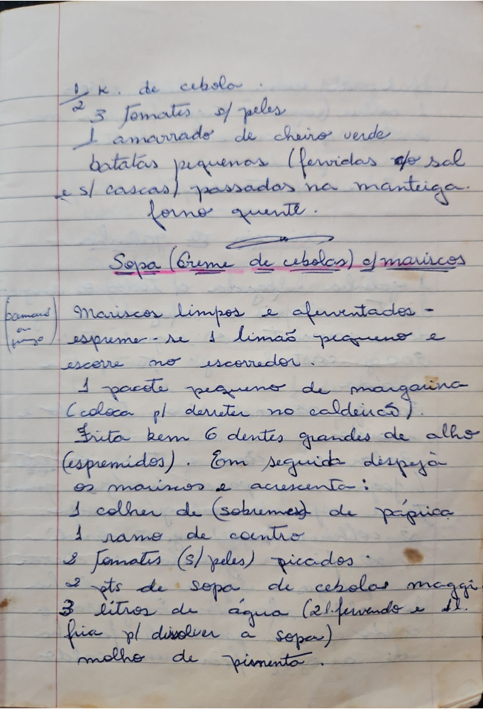

# Página 30
:::danger[NÃO REVISADO]
A página não foi revisada, portanto pode conter erros de digitação, formatação ou alucinações.
:::
## Sopa (Creme de cebolas) de mariscos

½ K. de cebola
3 Tomates s/ peles
1 amarrado de cheiro verde
Batatas pequenas (fervidas c/ sal
e s/ cascas) passadas na manteiga.
forno quente.

Mariscos limpos e aferventados -
espreme-se 1 limão pequeno e
escorre no escorredor.
1 pacote pequeno de margarina
(coloca p/ derreter no caldeirão).
Frita bem 6 dentes grandes de alho
(espremidos). Em seguida despeja
os mariscos e acrescenta:
- 1 colher de (sobremesa) de páprica
- 1 ramo de coentro
- 2 Tomates (s/ peles) picados
- 2 pts de sopa de cebolas maggi
- 3 litros de água (2 l. fervendo e 1 l.
fria p/ dissolver a sopa)
molho de pimenta.

