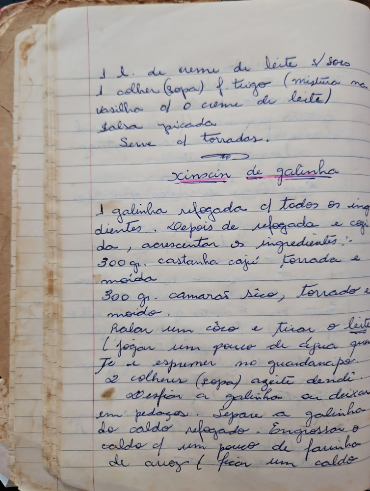

# Página 31
:::danger[NÃO REVISADO]
A página não foi revisada, portanto pode conter erros de digitação, formatação ou alucinações.
:::
- 1 l. de creme de leite s/sôro
- 1 colher (sopa) f. trigo (mistura na
- vasilha c/ o creme de leite)
- salsa picada
- Serve c/ torradas.

### Xinxin de galinha

- 1 galinha refogada c/ todos os ingredientes. Depois de refogada e cozida, acrescentar os ingredientes:
- 300 gr. castanha cajú torrada e moída
- 300 gr. camarão sico, torrado e moída.
- Ralar um côco e tirar o leite (jogar um pouco de água quente e espremer no guardanapo).
- 2 colheres (sopa) azeite dendê.
- desfiar a galinha ou deixar em pedaços. Separe a galinha do caldo refogado. Engrossar o caldo c/ um pouco de farinha de arroz (ficar um caldo

