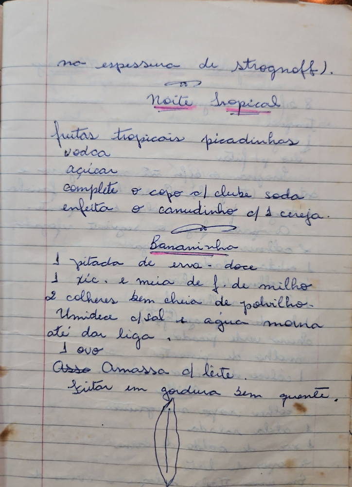

# Página 32
:::danger[NÃO REVISADO]
A página não foi revisada, portanto pode conter erros de digitação, formatação ou alucinações.
:::
na espessura de strognoff).

## Noite Tropical
- frutas tropicais picadinhas
- vodca
- açucar
- complete o copo c/ clube soda
- enfeita o canudinho c/ 1 cereja.

## Bananinho
- 1 pitada de erva- doce
- 1 xíc. e meia de f. de milho
- 2 colheres bem cheia de polvilho.
- Umidece c/ sal e agua morna
- até dar liga,
- 1 ovo
- Assa Amassa c/ leite.
- fritar em gordura sem quente.

