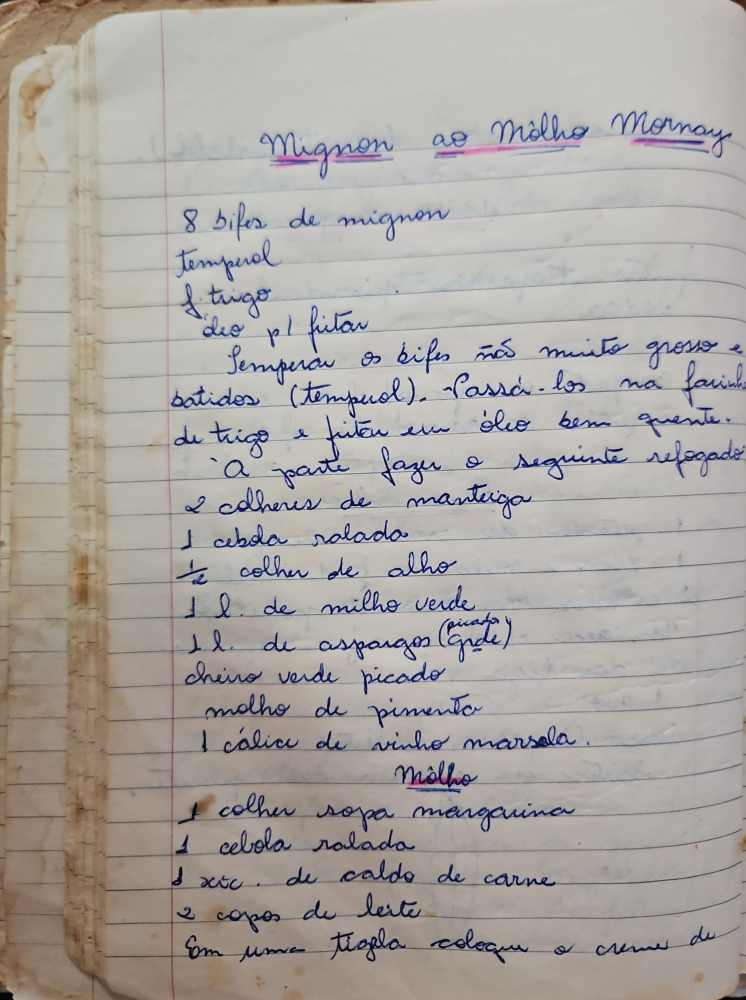

# Página 33
:::danger[NÃO REVISADO]
A página não foi revisada, portanto pode conter erros de digitação, formatação ou alucinações.
:::
## Mignon ao Molho Mornay

*   8 bifes de mignon
*   Tempural
*   ½ trigo
*   Ovo p/ fritar

*   Temperar os bifes não muito grossos e batidos (tempural).
*   Passá-los na farinha de trigo e fritar em óleo bem quente.

### A parte fazer o seguinte refogado:

*   2 colheres de manteiga
*   1 cebola ralada
*   ½ colher de alho
*   1 l. de milho verde
*   1 l. de aspargos (Grade)
*   cheiro verde picado
*   molho de pimenta
*   1 cálice de vinho marsala

### Molho

*   1 colher sopa margarina
*   1 cebola ralada
*   1 xc. de caldo de carne
*   2 copos de leite
*   Em uma tigela coloque o creme de

