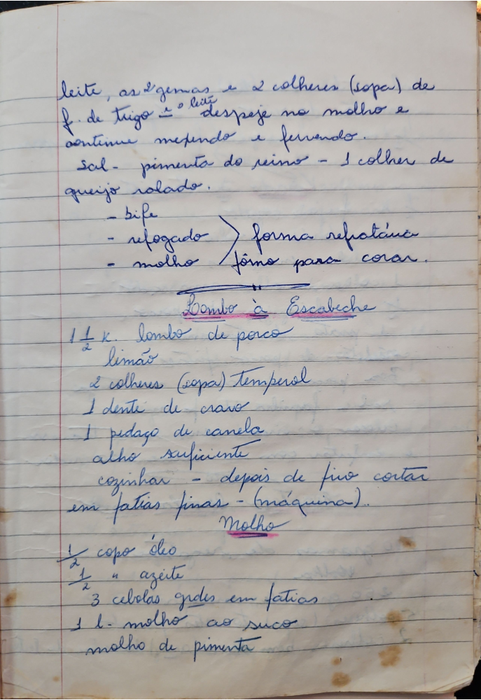

# Página 34
:::danger[NÃO REVISADO]
A página não foi revisada, portanto pode conter erros de digitação, formatação ou alucinações.
:::
* leite, as 2 gemas e 2 colheres (sopa) de f. de trigo - o leite despeje no molho e continue mexendo e fervendo.
* sal - pimenta do reino - 1 colher de queijo ralado.
    - bife
    - refogado > forma refratária
    - molho > fôrno para corar.

## Lombo à Escabeche

* 1 1/2 K. lombo de porco
* limão
* 2 colheres (sopa) Temperol
* 1 dente de cravo
* 1 pedaço de canela
* alho suficiente
* cozinhar - depois de frio cortar em fatias finas - (máquina).

### Molho

* 1/2 copo óleo
* 1/2 " azeite
* 3 cebolas grandes em fatias
* 1 l. molho ao suco
* molho de pimenta

