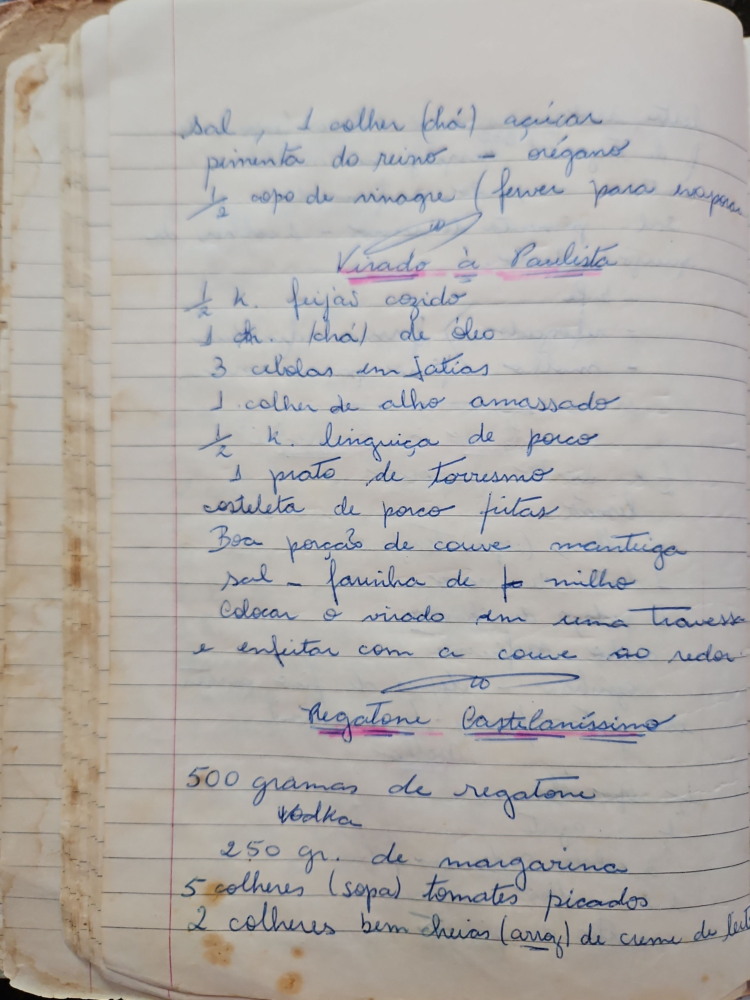

# Página 35
:::danger[NÃO REVISADO]
A página não foi revisada, portanto pode conter erros de digitação, formatação ou alucinações.
:::
## Virado à Paulista

*   Sal, 1 colher (chá) açúcar
*   pimenta do reino - orégano
*   ½ copo de vinagre (ferver para evaporar)
*   ½ k. feijão cozido
*   1 ch. (chá) de óleo
*   3 cebolas em fatias
*   1 colher de alho amassado
*   ½ k. linguiça de porco
*   1 prato de Torresmo
*   costeleta de porco fritas
*   Boa porção de couve manteiga
*   sal - farinha de fo milho
*   Colocar o virado em uma travessa
*   e enfeitar com a couve ao redor

## Regatone Castellanissimo

*   500 gramas de regatone
*   vodka
*   250 gr. de margarina
*   5 colheres (sopa) tomates picados
*   2 colheres bem cheias (arroz) de creme de leite

