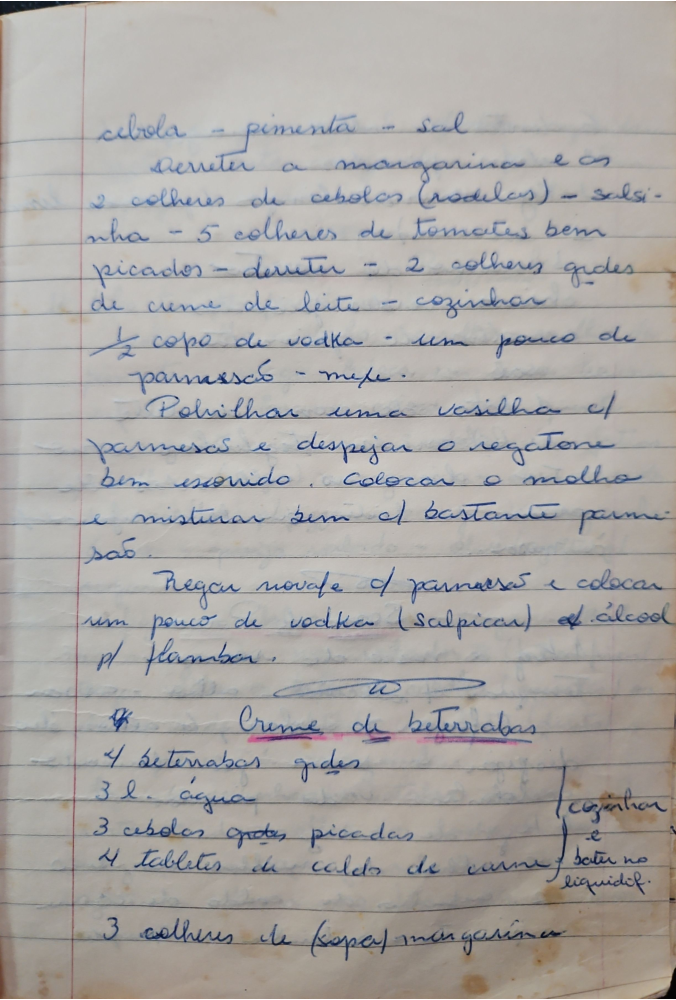

# Página 36
:::danger[NÃO REVISADO]
A página não foi revisada, portanto pode conter erros de digitação, formatação ou alucinações.
:::
cebola - pimenta - sal
Derreter a margarina e as
2 colheres de cebolas (rodelas) - salsinha
- 5 colheres de tomates bem picados - derreter - 2 colheres grades
de creme de leite - cozinhar
½ copo de vodka - um pouco de parmesão - mexer.

Polvilhar uma vasilha c/ parmesão e despejar o ragatone
bem escorrido. Colocar o molho e misturar bem c/ bastante parmesão.

Regar novale c/ parmesão e colocar um pouco de vodka (salpicar) p/ flambar.

## Creme de beterabas

* 4 beterabas grades
* 3 l. água
* 3 cebolas grades picadas
* 4 tabletes de caldo de carne
* 3 colheres de (sopa) margarina

cozinhar e bater no liquidof.

