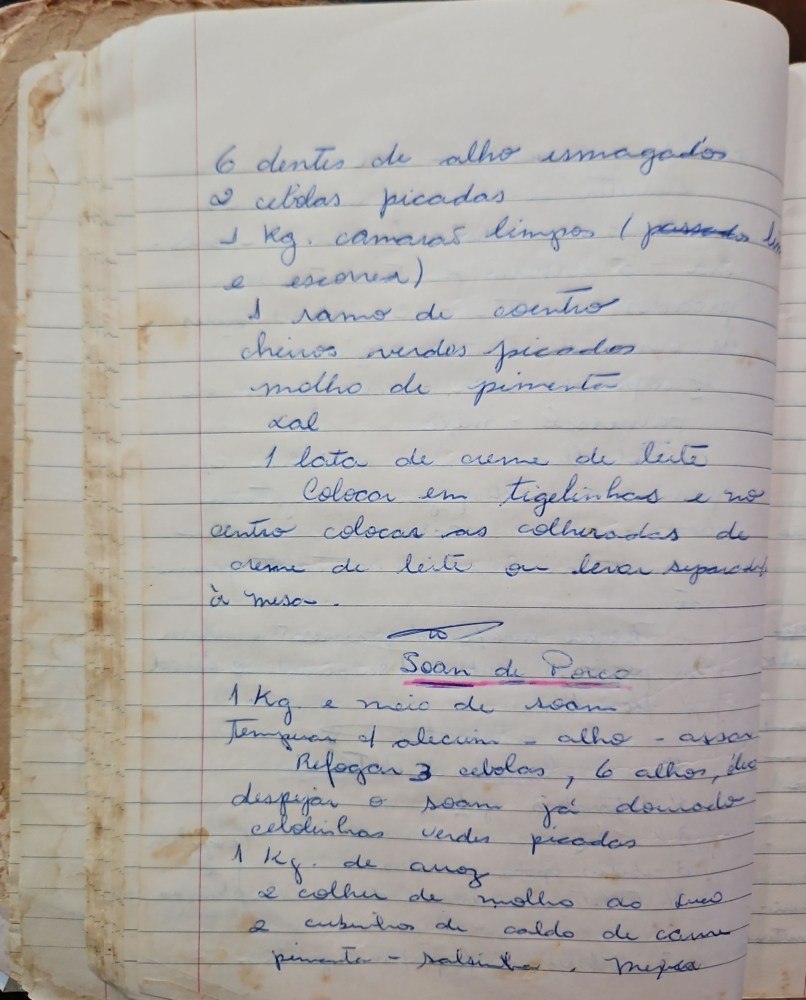

# Página 37
:::danger[NÃO REVISADO]
A página não foi revisada, portanto pode conter erros de digitação, formatação ou alucinações.
:::
## Camarão (Recipe 1 - Title not explicitly written, inferred from ingredients)

- 6 dentes de alho esmagados
- 2 cebolas picadas
- 1 Kg. camarão limpos (passado na escova)
- 1 ramo de coentro
- cheiros verdes picados
- molho de pimenta
- sal
- 1 lata de creme de leite
- Colocar em tigelinhas e no centro colocar as colheradas de creme de leite ou levar separado à mesa.

## Soan de Porco

- 1 Kg e meio de soan
- Temperar c' alecrim - alho - assar
- Refogar 3 cebolas , 6 alhos, depois
- despigar o soam já assado
- cebolinhas verdes picadas
- 1 Kg. de arroz
- 2 colhes de molho ao fundo
- 2 cubinhos de caldo de carne
- pimenta - salsinha - salsa

