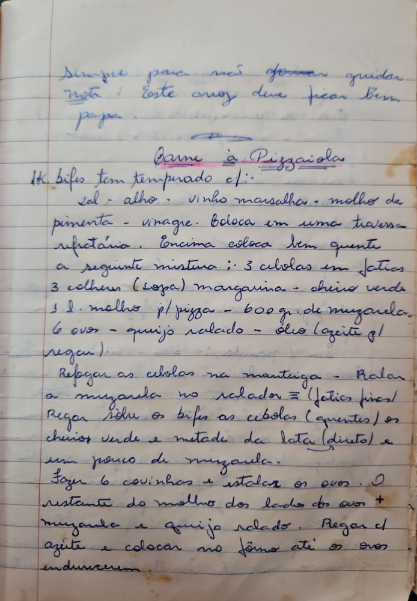

# Página 38
:::danger[NÃO REVISADO]
A página não foi revisada, portanto pode conter erros de digitação, formatação ou alucinações.
:::
Simpre para não formar quidar nota ! Este arroz deve ficar bem papa.

## Carne à Pizzaiola

1k. bifes tem temperado c/:
- sal
- alho
- vinho marsalha
- molho de pimenta
- vinagre.

Boleca em uma travessa refratária. Encima coloca bem quente a seguinte mistura :

### Ingredientes para a Cobertura
- 3 cebolas em fatias
- 3 colheres (sopa) margarina - cheiro verde
- 1 l. molho pl/pizza - 600 gr. de muzarela.
- 6 ovos - quijo ralado - óleo (azeite pl regar).

### Modo de Preparo
- Refogar as cebolas na manteiga.
- Ralar a muzarela no ralador (fatias finas).
- Regar sobre os bifes as cebolas (quentes), os cheiros verde e metade da lata (direto) e um pouco de muzarela.
- Fazer 6 covinhas e estalar os ovos.
- O restante do molho dos lados dos ovos + muzarela e quijo ralado.
- Regar cl azeite e colocar no fôrno até os ovos endurecerem.

