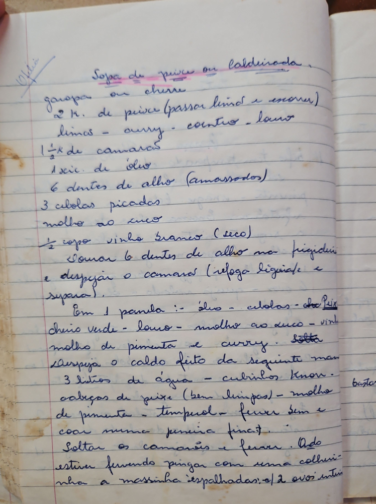

# Página 39
:::danger[NÃO REVISADO]
A página não foi revisada, portanto pode conter erros de digitação, formatação ou alucinações.
:::
## Sopa de peixe ou caldeirada
(garoupa ou cherne)

- 2 k. de peixe (passar limão e enxugar)
- limão
- curry
- coentro
- louro
- 1 1/4 de camarões
- 1 xc. de óleo
- 6 dentes de alho (amassados)
- 3 cebolas picadas
- molho ao suco
- 1/2 copo vinho branco (seco)

Tomar 6 dentes de alho na frigideira e despejar o camarões (refoga ligeira e separa).

Em 1 panela: - óleo - cebolas - alho - peixe - cheiro verde - louro - molho ao suco - vinho - molho de pimenta e curry.

Solta...

Despeja o caldo feito da seguinte maneira:
- 3 litros de água
- cubinhos Knorr
- cabeças de peixe (bem limpas)
- molho de pimenta
- tempêrol
- ferver bem e coar numa peneira fina.

Soltar os camarões e ferver.

Quando estiver fervendo pingar com uma colherinha a massinha espalhadas c/ 2 ovos inteiros.

