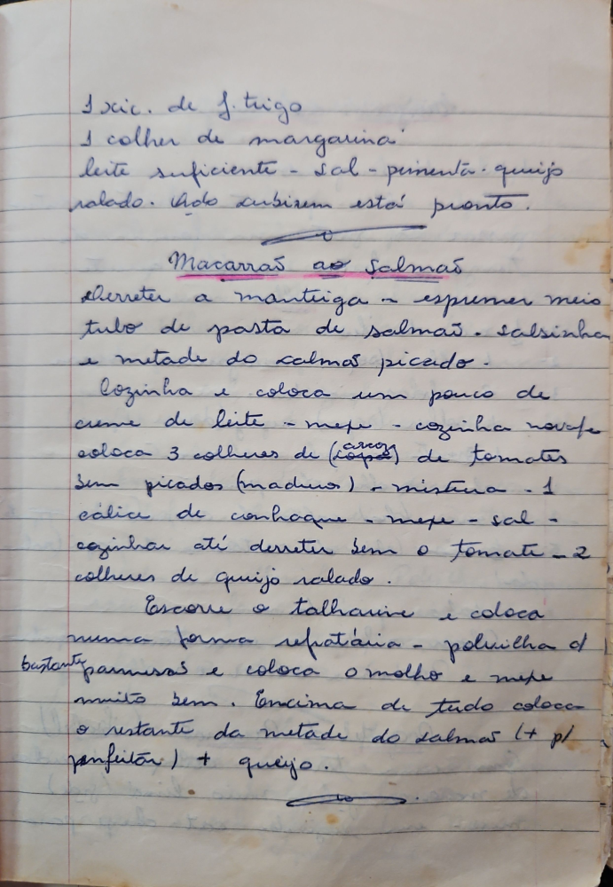

# Página 40
:::danger[NÃO REVISADO]
A página não foi revisada, portanto pode conter erros de digitação, formatação ou alucinações.
:::
- 1 xíc. de f. trigo
- 1 colher de margarina
- leite suficiente - sal - pimenta - queijo ralado. qdo subirem está pronto.

## Macarrão ao Salmão

- Derreter a manteiga e espremer meio tubo de pasta de salmão, salsinha e metade do salmão picado.
- Cozinhar e colocar um pouco de creme de leite - mexa - cozinhe novamente.
- colocar 3 colheres de (arroz) de tomates bem picados (maduros) - mistura - 1 cálice de conhaque - mexa - sal - cozinhar até derreter bem o tomate - 2 colheres de queijo ralado.
- Escorra o talharim e coloca numa forma refratária - polvilha bastante parmesão e coloca o molho e mexa muito bem.
- Em cima de tudo coloca o restante da metade do salmão (+ p/ enfeitar) + queijo.

