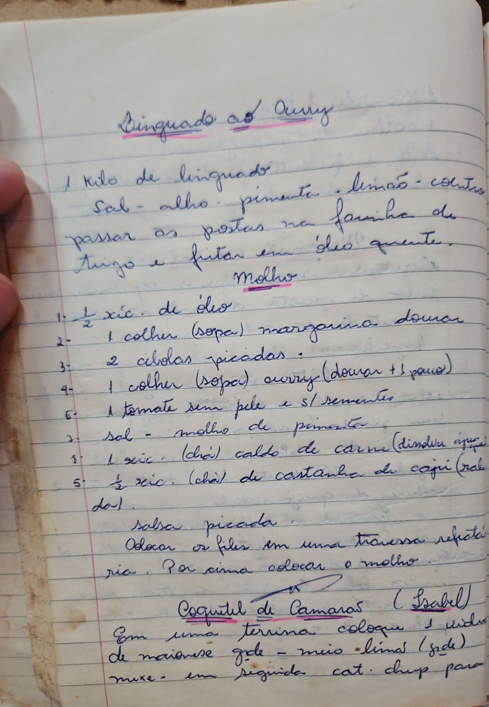

# Página 41
:::danger[NÃO REVISADO]
A página não foi revisada, portanto pode conter erros de digitação, formatação ou alucinações.
:::
## Linguado ao Curry

1 kilo de linguado
Sal - alho - pimenta - limão - coentro
passar as postas na farinha de trigo e fritar em óleo quente.

### Molho

1.  ½ xíc. de óleo
2.  1 colher (sopa) margarina dourar
3.  2 cebolas picadas
4.  1 colher (sopa) curry (dourar + 1 pouco)
6.  1 tomate sem pele e s/ sementes
7.  sal - molho de pimenta
8.  1 xic. (chá) caldo de carne (dissolvi agua)
5.  ½ xíc. (chá) de castanha de caju (ralada)

salsa picada
Colocar os filés em uma travessa refratária. Por cima colocar o molho.

## Coquetel de Camarão (Isabel)

Em uma terrina coloque 1 vidro de maionese gde - meio limão (gde) mexe - em seguida cat. chup para

