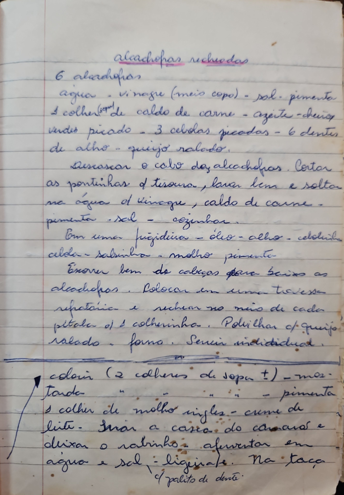

# Página 42
:::danger[NÃO REVISADO]
A página não foi revisada, portanto pode conter erros de digitação, formatação ou alucinações.
:::

## Alcachofras Recheadas

### Ingredientes
- 6 alcachofras
- agua
- vinagre (meio copo)
- sal
- pimenta
- 1 colher de caldo de carne
- azeite
- cheiro verdes picado
- 3 cebolas picadas
- 6 dentes de alho
- queijo ralado.

### Modo de Preparo
1.  Descascar o cabo das alcachofras. Cortar as pontinhas c/ tesoura, lavar bem e soltar na agua c/ vinagre, caldo de carne - pimenta - sal - cozinhar.
2.  Em uma frigideira - óleo - alho - cebola - salsa - salsinha - molho pimenta
3.  Ensopar bem as cabeças para baixo as alcachofras.
4.  Colocar em uma travessa refrataria e rechear no meio de cada petala c/ 1 colherinha.
5.  Polvilhar c/ queijo ralado - forno.
6.  Servir individual.

### Notas Adicionais / Complementos para o Recheio
- colorir (2 colheres de sopa ±)
- mostarda
- pimenta
- 1 colher de molho ingles
- creme de leite
- Tirar a casca do camarão e deixar o rabinho.
- aferventar em agua e sal - ligeiramente.
- Na taça c/ palito de dente.

