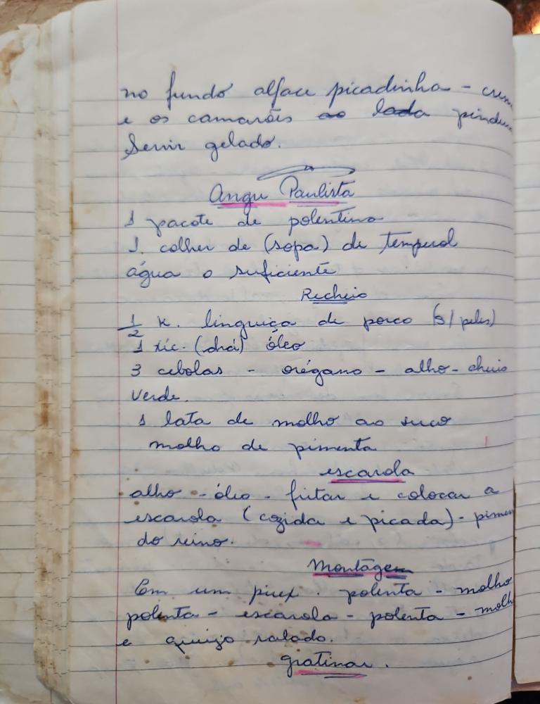

# Página 43
:::danger[NÃO REVISADO]
A página não foi revisada, portanto pode conter erros de digitação, formatação ou alucinações.
:::
no fundo alface picadinho - com
e os camarões ao lado pindur
Servir gelado.

## Angu Paulista

- 1 pacote de polentina
- 1 colher de (Sopa) de Tempural
- água o suficiente

### Recheio

- ½ K. linguiça de porco (S/ peles)
- 1 xic. (chá) óleo
- 3 cebolas - orégano - alho - cheiro
  Verde.
- 1 lata de molho ao sugo
- molho de pimenta

escarola
- • alho - óleo - fritar e colocar a
  escarola (cozida e picada) - pimenta
  do reino.

### Montagem

Em um pirex. polenta - molho
polenta - escarola - polenta - molho
e queijo ralado.

Gratinar.

