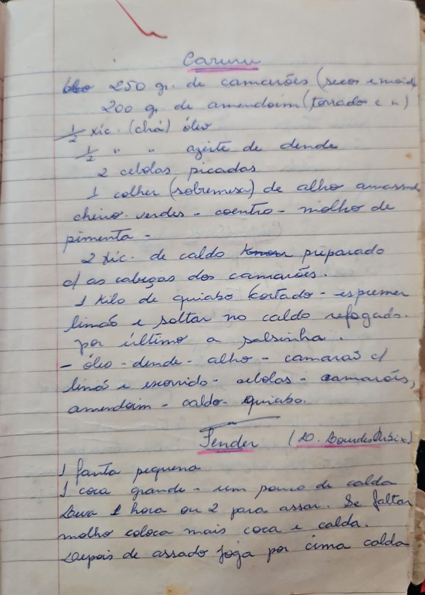

# Página 44
:::danger[NÃO REVISADO]
A página não foi revisada, portanto pode conter erros de digitação, formatação ou alucinações.
:::
## Caruru

- 250 gr. de camarões (seco e moído)
- 200 gr. de amendoim (torrado e s/ pele)
- ½ xic. (chá) óleo
- ½ xic. azeite de dende
- 2 cebolas picadas
- 1 colher (sobremesa) de alho amassado
- cheiro verde - coentro - molho de pimenta
- 2 xic. de caldo temos preparado c/ as cabeças dos camarões.
- 1 kilo de quiabo cortado - espremer limão e soltar no caldo refogado.
- por último a salsinha.
- óleo - dende - alho - camarão c/ limão e escorrido - cebolas - camarões, amendoim - caldo. Quiabo.

## Tender

(LD. Bourdesir)

- 1 Fanta pequena
- 1 coca grande - um pouco de calda.
- leva 1 hora ou 2 para assar. Se faltar molho coloca mais coca e calda.
- Depois de assado joga por cima calda.

